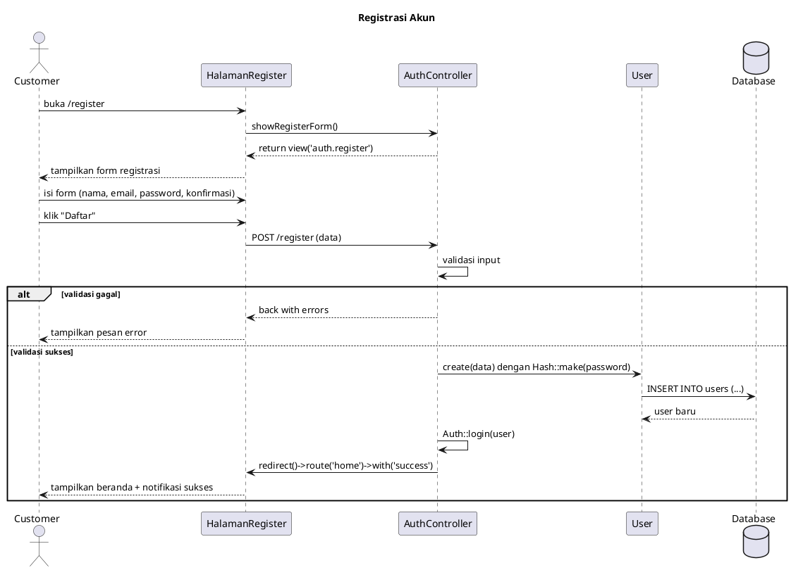
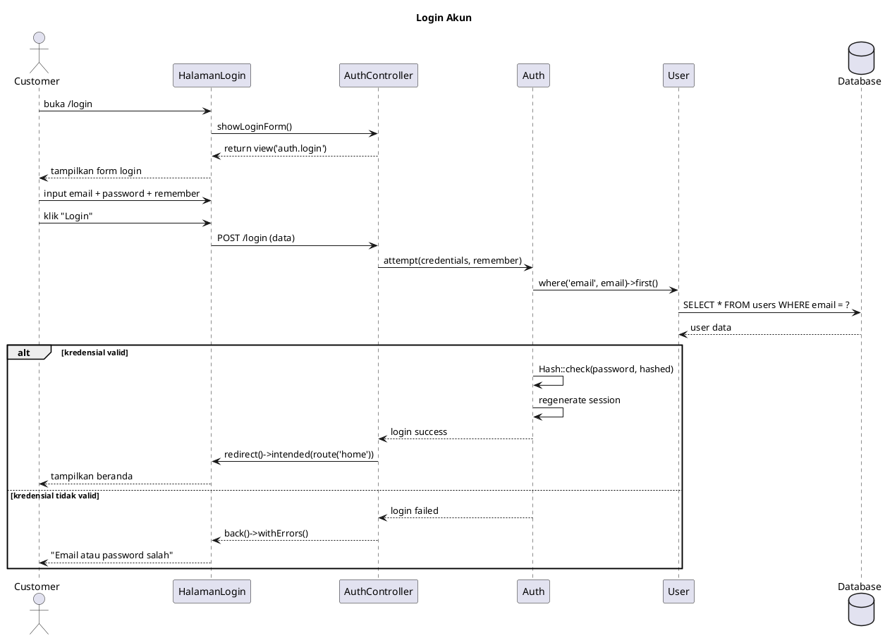
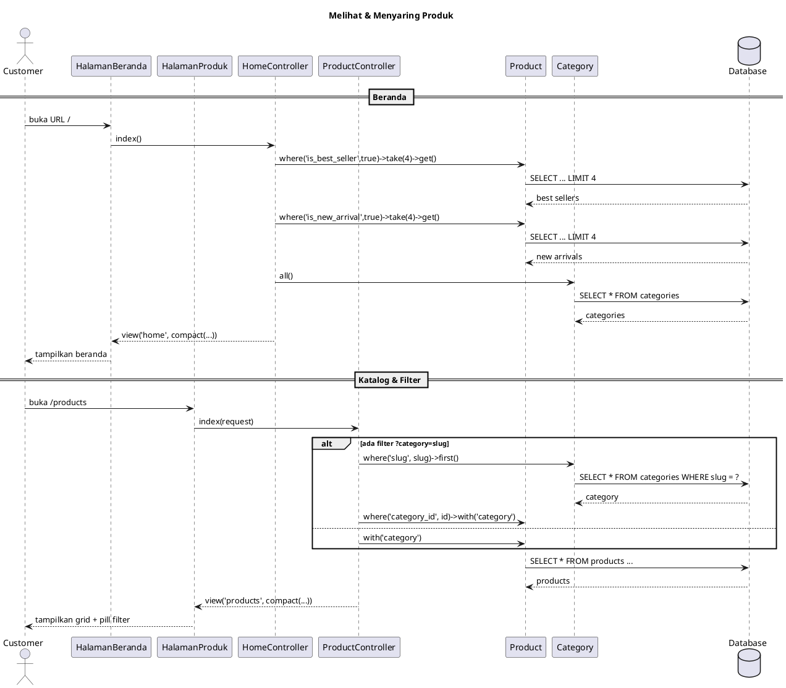
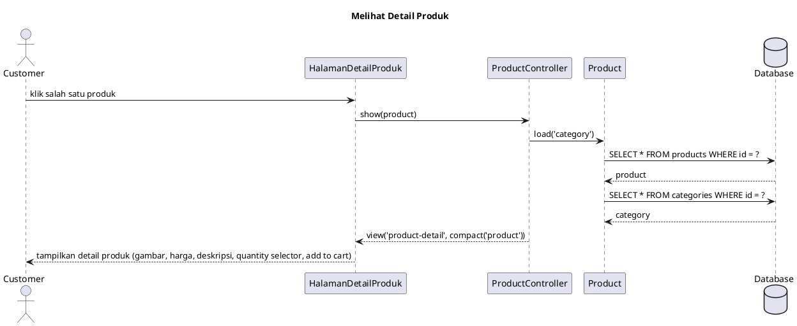
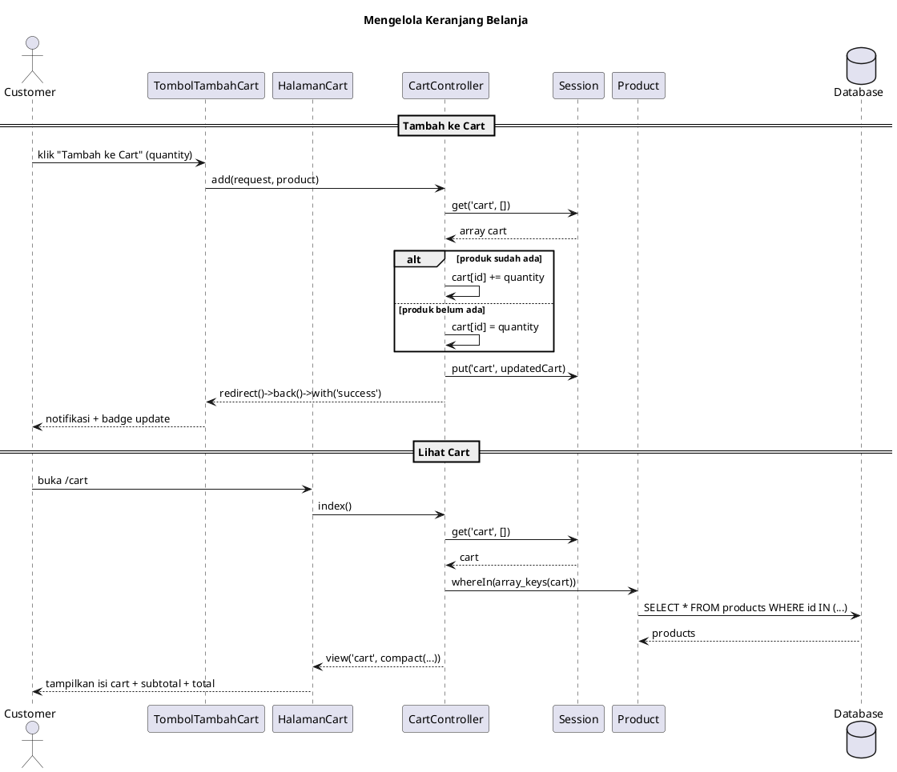
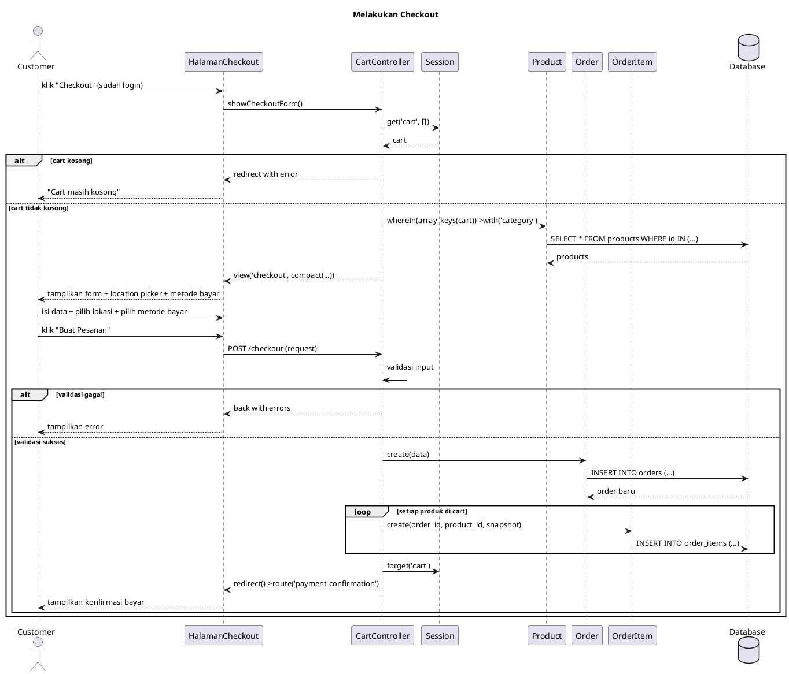
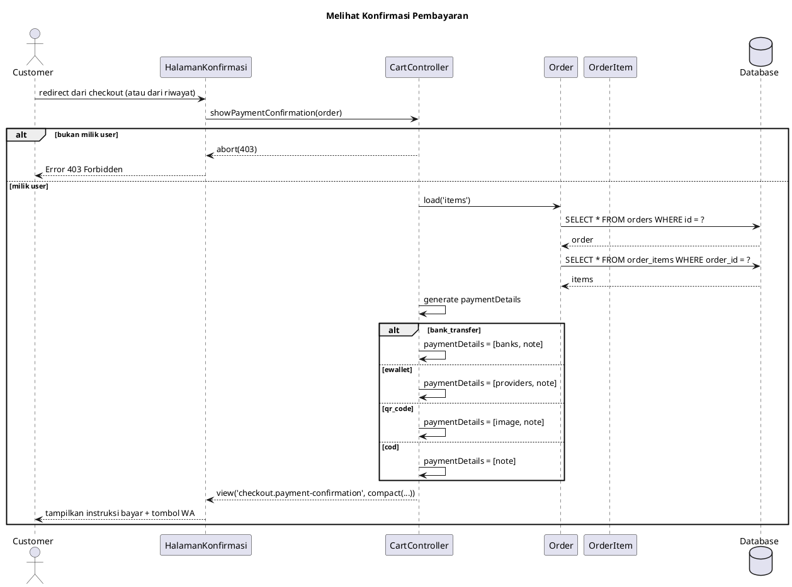
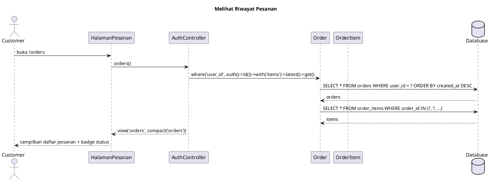
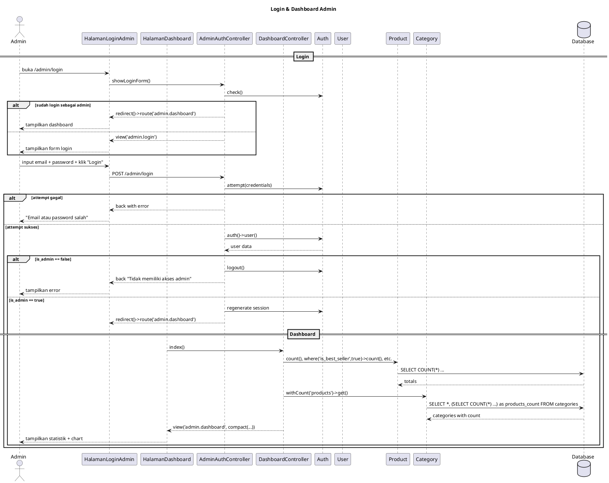
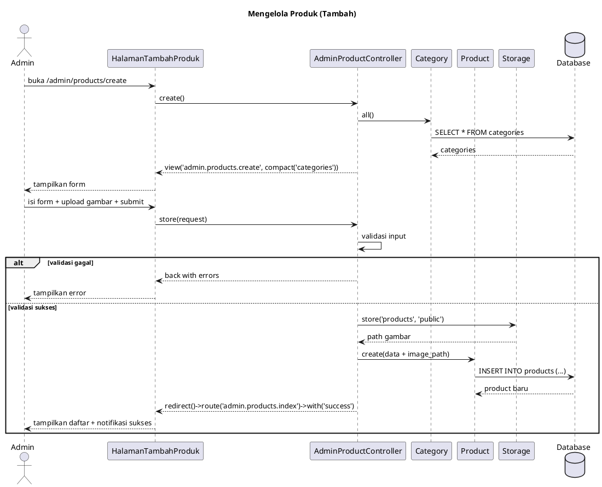

# DPPL — Deskripsi Perancangan Perangkat Lunak

**Aplikasi:** LiquidPedia (Web E-Commerce Liquid & Vape)
**Mata Kuliah:** Analisis dan Perancangan Perangkat Lunak (ABP)
**Prodi:** Informatika — Telkom University

---

## Daftar Isi

- [B1. Arsitektur Perangkat Lunak](#b1-arsitektur-perangkat-lunak)
- [B2. Daftar Use Case yang Akan Dirancang](#b2-daftar-use-case-yang-akan-dirancang)
- [B3. Identifikasi Object dan Tipe Kelas](#b3-untuk-setiap-use-case--identifikasi-object-dan-tipe-kelas)
- [B4. Use Case Scenario & Deskripsi Halaman UI](#b4-untuk-setiap-use-case--use-case-scenario--deskripsi-halaman-ui)
- [B5. Data Sequence Diagram](#b5-untuk-setiap-use-case--data-sequence-diagram)
- [B6. Diagram Kelas Keseluruhan (Perancangan)](#b6-diagram-kelas-keseluruhan-perancangan)
- [B7. Perancangan Algoritma](#b7-perancangan-algoritma)
- [B8. Perancangan Query Database](#b8-perancangan-query-database)
- [B9. Matriks Kerunutan](#b9-matriks-kerunutan-requirement-traceability-matrix)
- [B10. Syntax Sequence Diagram (PlantUML)](#b10-syntax-sequence-diagram-plantuml)

---

## B1. Arsitektur Perangkat Lunak

### Arsitektur yang Digunakan
- **Pola Arsitektur:** MVC (Model-View-Controller) dengan pola **Client-Server**
- **Layered Architecture:** Presentation Layer (View) → Application Layer (Controller) → Data Layer (Model/Database)
- **Komunikasi Web:** HTTP *Request-Response* via browser
- **Komunikasi API (rencana):** JSON via REST API *endpoints* (Laravel Sanctum)

### Komponen Utama Sistem

| Komponen | Letak | Fungsi |
|----------|-------|--------|
| **Router** | `routes/web.php` | Memetakan URL ke *controller method* yang sesuai |
| **Controller** | `app/Http/Controllers/` | Menerima *request*, menjalankan logika bisnis, mengembalikan *response* (view) |
| **Model** | `app/Models/` | Representasi data, logika relasi, *accessor*, dan *mutator* |
| **View** | `resources/views/` | Template Blade untuk rendering HTML (customer dan admin) |
| **Middleware** | `app/Http/Middleware/` | Lapisan keamanan: `auth` (cek login), `admin` (cek `is_admin`), CSRF |
| **Database** | MySQL / MariaDB | Penyimpanan data relasional |
| **Session** | Laravel Session (database) | Penyimpanan data keranjang sementara |
| **Storage** | Laravel Storage (disk `public`) | Penyimpanan file *upload* gambar produk |

### Alur Request

```
Browser → HTTP Request → Router → Middleware → Controller → Model → Database
                                                              ↓
                                                       View (Blade)
                                                              ↓
Browser ← HTTP Response ← HTML ←────────────────────────
```

### Hak Akses Aktor

| Aktor | Hak Akses |
|-------|-----------|
| **Guest (Belum Login)** | Melihat beranda, katalog produk, detail produk, menambah ke keranjang (session), login, register |
| **Customer (Login)** | Semua akses Guest + checkout, membuat pesanan, melihat pesanan sendiri, melihat profil, logout |
| **Admin (`is_admin = true`)** | Login admin panel, dashboard statistik, CRUD produk, logout admin |

---

## B2. Daftar 10 Use Case yang Akan Dirancang

| No | Nama Use Case | Deskripsi Singkat |
|----|--------------|-------------------|
| 1 | Registrasi Akun | Customer mendaftarkan akun baru |
| 2 | Login Akun | Customer masuk ke sistem |
| 3 | Melihat & Menyaring Produk | Customer melihat katalog produk dengan filter kategori |
| 4 | Melihat Detail Produk | Customer melihat informasi lengkap produk |
| 5 | Mengelola Keranjang Belanja | Customer menambah/mengubah/menghapus item di keranjang |
| 6 | Melakukan Checkout | Customer membuat pesanan dengan data pengiriman dan location picker |
| 7 | Melihat Konfirmasi Pembayaran | Customer melihat instruksi pembayaran sesuai metode |
| 8 | Melihat Riwayat Pesanan | Customer melihat daftar semua pesanan |
| 9 | Login & Dashboard Admin | Admin login dan melihat dashboard statistik toko |
| 10 | Mengelola Produk | Admin melakukan CRUD data produk (termasuk upload gambar) |

---

## B3. Untuk SETIAP Use Case — Identifikasi Object dan Tipe Kelas

### UC-01: Registrasi Akun

| No | Nama Object Baru | Jenis / Tipe Kelas |
|----|-----------------|-------------------|
| 1 | HalamanRegister | Boundary |
| 2 | AuthController | Controller |
| 3 | User | Entity |

### UC-02: Login Akun

| No | Nama Object Baru | Jenis / Tipe Kelas |
|----|-----------------|-------------------|
| 1 | HalamanLogin | Boundary |
| 2 | AuthController | Controller |
| 3 | User | Entity |

### UC-03: Melihat & Menyaring Produk

| No | Nama Object Baru | Jenis / Tipe Kelas |
|----|-----------------|-------------------|
| 1 | HalamanBeranda | Boundary |
| 2 | HalamanProduk | Boundary |
| 3 | HomeController | Controller |
| 4 | ProductController | Controller |
| 5 | Product | Entity |
| 6 | Category | Entity |

### UC-04: Melihat Detail Produk

| No | Nama Object Baru | Jenis / Tipe Kelas |
|----|-----------------|-------------------|
| 1 | HalamanDetailProduk | Boundary |
| 2 | ProductController | Controller |
| 3 | Product | Entity |
| 4 | Category | Entity |

### UC-05: Mengelola Keranjang Belanja

| No | Nama Object Baru | Jenis / Tipe Kelas |
|----|-----------------|-------------------|
| 1 | TombolTambahCart | Boundary |
| 2 | HalamanCart | Boundary |
| 3 | CartController | Controller |
| 4 | Session (Cart) | Entity (session-based) |

### UC-06: Melakukan Checkout

| No | Nama Object Baru | Jenis / Tipe Kelas |
|----|-----------------|-------------------|
| 1 | HalamanCheckout | Boundary |
| 2 | LocationPicker (Component) | Boundary |
| 3 | CartController | Controller |
| 4 | Order | Entity |
| 5 | OrderItem | Entity |
| 6 | Session (Cart) | Entity (session-based) |

### UC-07: Melihat Konfirmasi Pembayaran

| No | Nama Object Baru | Jenis / Tipe Kelas |
|----|-----------------|-------------------|
| 1 | HalamanKonfirmasi | Boundary |
| 2 | CartController | Controller |
| 3 | Order | Entity |
| 4 | OrderItem | Entity |

### UC-08: Melihat Riwayat Pesanan

| No | Nama Object Baru | Jenis / Tipe Kelas |
|----|-----------------|-------------------|
| 1 | HalamanPesanan | Boundary |
| 2 | AuthController | Controller |
| 3 | Order | Entity |
| 4 | OrderItem | Entity |

### UC-09: Login & Dashboard Admin

| No | Nama Object Baru | Jenis / Tipe Kelas |
|----|-----------------|-------------------|
| 1 | HalamanLoginAdmin | Boundary |
| 2 | HalamanDashboard | Boundary |
| 3 | Admin\AuthController | Controller |
| 4 | Admin\DashboardController | Controller |
| 5 | User | Entity |
| 6 | Product | Entity |
| 7 | Category | Entity |

### UC-10: Mengelola Produk

| No | Nama Object Baru | Jenis / Tipe Kelas |
|----|-----------------|-------------------|
| 1 | HalamanDaftarProduk | Boundary |
| 2 | HalamanTambahProduk | Boundary |
| 3 | HalamanEditProduk | Boundary |
| 4 | Admin\ProductController | Controller |
| 5 | Product | Entity |
| 6 | Category | Entity |
| 7 | Storage (File System) | Controller |

---

## B4. Untuk SETIAP Use Case — Use Case Scenario & Deskripsi Halaman UI

### UC-01: Registrasi Akun

**Skenario Use Case #1 — Registrasi Akun**

**i. Pre-Condition**
- Pengguna belum memiliki akun sebelumnya.
- Halaman registrasi dapat diakses melalui halaman utama aplikasi.

**ii. Use Case Description**

**a. Primary Flow**
- Membuka halaman `/register`
- Menampilkan formulir registrasi berisi kolom nama, email, password, dan konfirmasi password
- Mengisi biodata pada form
- Menekan tombol "Daftar"
- Memvalidasi data input
- Menambahkan data akun baru ke database
- Mengalihkan ke halaman beranda
- Menampilkan notifikasi "Registrasi berhasil"

**b. Alternative Flow**
- Membuka halaman `/register`
- Menampilkan formulir registrasi
- Mengisi data dengan format salah atau data tidak lengkap
- Menekan tombol "Daftar"
- Menampilkan pesan kesalahan validasi (email sudah terdaftar, password kurang dari 8 karakter, konfirmasi password tidak cocok)
- Memperbaiki data dan menekan tombol "Daftar" kembali
- Memvalidasi ulang data dan melanjutkan ke proses pembuatan akun jika valid
- Jika data tetap tidak valid, kembali menampilkan pesan kesalahan

**iii. Post-Condition**
- Akun baru tersimpan di database.
- Pengguna dapat melakukan login menggunakan akun yang telah dibuat.

**iv. Tabel Deskripsi Layar**

| ID Layar | Nama Layar | Deskripsi |
|----------|-----------|-----------|
| SCR-REG | Halaman Registrasi | Halaman untuk mendaftarkan akun customer baru |

**v. Tabel Detail Objek UI**

| Id_Objek | Jenis | Label | Keterangan |
|----------|-------|-------|------------|
| REG-01 | Input Text | Nama Lengkap | Wajib diisi, maksimal 255 karakter |
| REG-02 | Input Email | Email | Wajib diisi, format email, harus unik |
| REG-03 | Input Password | Password | Wajib diisi, minimal 8 karakter |
| REG-04 | Input Password | Konfirmasi Password | Wajib diisi, harus sama dengan password |
| REG-05 | Button | Daftar | Tombol submit untuk mendaftar |
| REG-06 | Link | Sudah punya akun? Login | Tautan ke halaman login |

---

### UC-02: Login Akun

**Skenario Use Case #2 — Login Akun**

**i. Pre-Condition**
- Pengguna sudah memiliki akun yang terdaftar.
- Pengguna belum login ke dalam aplikasi.

**ii. Use Case Description**

**a. Primary Flow**
- Membuka halaman `/login`
- Menampilkan formulir login berisi kolom email, password, dan opsi "Ingat Saya"
- Memasukkan email dan password
- Menekan tombol "Login"
- Memvalidasi kredensial login
- Mengalihkan ke halaman beranda

**b. Alternative Flow**
- Membuka halaman `/login`
- Menampilkan formulir login
- Memasukkan email atau password yang salah
- Menekan tombol "Login"
- Menampilkan pesan "Email atau password salah"
- Memasukkan kembali email dan password yang benar
- Menekan tombol "Login" kembali
- Memvalidasi kredensial dan melanjutkan ke halaman beranda jika valid
- Jika masih salah, tetap di halaman login dengan pesan kesalahan

**iii. Post-Condition**
- Pengguna berhasil login dan session tersimpan.
- Pengguna dapat mengakses halaman checkout, profil, dan riwayat pesanan.

**iv. Tabel Deskripsi Layar**

| ID Layar | Nama Layar | Deskripsi |
|----------|-----------|-----------|
| SCR-LOG | Halaman Login | Halaman untuk login customer |

**v. Tabel Detail Objek UI**

| Id_Objek | Jenis | Label | Keterangan |
|----------|-------|-------|------------|
| LOG-01 | Input Email | Email | Wajib diisi, format email |
| LOG-02 | Input Password | Password | Wajib diisi |
| LOG-03 | Checkbox | Ingat Saya | Opsi untuk menyimpan session login |
| LOG-04 | Button | Login | Tombol submit untuk login |
| LOG-05 | Link | Belum punya akun? Daftar | Tautan ke halaman register |

---

### UC-03: Melihat & Menyaring Produk

**Skenario Use Case #3 — Melihat & Menyaring Produk**

**i. Pre-Condition**
- Pengguna membuka halaman utama aplikasi.
- Data produk dan kategori sudah tersedia di database.

**ii. Use Case Description**

**a. Primary Flow**
- Membuka URL `/`
- Menampilkan halaman beranda berisi hero section, 4 produk best seller, 2 kartu kategori (Vape & Liquid), dan 4 produk new arrival
- Membuka halaman `/products`
- Menampilkan seluruh produk dalam bentuk grid
- Menekan pill filter kategori (misal: "Vape")
- Menyaring produk berdasarkan kategori yang dipilih
- Menampilkan produk yang sudah difilter sesuai kategori

**b. Alternative Flow**
- Membuka halaman `/products` saat tidak ada produk
- Menampilkan pesan "Tidak ada produk yang ditemukan"
- Menekan pill kategori yang tidak memiliki slug valid
- Menampilkan seluruh produk sebagai fallback

**iii. Post-Condition**
- Halaman beranda atau katalog produk sesuai filter ditampilkan.
- Pengguna dapat memilih produk untuk melihat detail atau menambah ke keranjang.

**iv. Tabel Deskripsi Layar**

| ID Layar | Nama Layar | Deskripsi |
|----------|-----------|-----------|
| SCR-HOME | Halaman Beranda | Halaman utama aplikasi dengan hero, best seller, kategori, new arrival |
| SCR-PROD | Halaman Katalog Produk | Grid produk dengan pill filter kategori |

**v. Tabel Detail Objek UI — Beranda**

| Id_Objek | Jenis | Label | Keterangan |
|----------|-------|-------|------------|
| HOME-01 | Section | Hero | Banner promosi utama dengan headline branding |
| HOME-02 | Grid | Best Seller | 4 kartu produk best seller |
| HOME-03 | Card | Kategori | 2 kartu kategori (Vape & Liquid) dengan link filter |
| HOME-04 | Grid | New Arrival | 4 kartu produk baru dengan badge "BARU" |

**v. Tabel Detail Objek UI — Katalog**

| Id_Objek | Jenis | Label | Keterangan |
|----------|-------|-------|------------|
| PROD-01 | Pill Group | Filter Kategori | "Semua", "Vape", "Liquid" — klik untuk filter |
| PROD-02 | Grid | Grid Produk | Responsive 1-4 kolom |
| PROD-03 | Card | Kartu Produk | Gambar, nama, kategori badge, harga, tombol "Tambah ke Cart" |

---

### UC-04: Melihat Detail Produk

**Skenario Use Case #4 — Melihat Detail Produk**

**i. Pre-Condition**
- Pengguna berada di halaman katalog produk.
- Produk tersedia di database.

**ii. Use Case Description**

**a. Primary Flow**
- Menekan salah satu kartu produk dari halaman katalog
- Mengambil data produk dari database
- Menampilkan halaman detail yang berisi breadcrumb, gambar produk dengan efek hover zoom, badge kategori/best seller/new arrival, harga, deskripsi, quantity selector (+/-), tombol "Tambah ke Cart", dan tabel info produk

**b. Alternative Flow**
- Tidak ada skenario alternatif khusus — halaman detail selalu dapat ditampilkan selama produk valid

**iii. Post-Condition**
- Informasi lengkap produk ditampilkan.
- Pengguna dapat menambah produk ke keranjang.

**iv. Tabel Deskripsi Layar**

| ID Layar | Nama Layar | Deskripsi |
|----------|-----------|-----------|
| SCR-DET | Halaman Detail Produk | Halaman informasi lengkap satu produk |

**v. Tabel Detail Objek UI**

| Id_Objek | Jenis | Label | Keterangan |
|----------|-------|-------|------------|
| DET-01 | Breadcrumb | Navigasi | Beranda > Produk > Nama Produk |
| DET-02 | Image | Gambar Produk | Efek hover zoom |
| DET-03 | Badge | Badge Status | Badge kategori, "Best Seller", "BARU" |
| DET-04 | Text | Harga | Format Rp |
| DET-05 | Selector | Quantity | Tombol - / input number / +, minimal 1 |
| DET-06 | Button | Tambah ke Cart | POST /cart/add/{product} |
| DET-07 | Table | Info Produk | Tabel: Kategori, Status Stok, Garansi |

---

### UC-05: Mengelola Keranjang Belanja

**Skenario Use Case #5 — Mengelola Keranjang Belanja**

**i. Pre-Condition**
- Pengguna berada di halaman produk atau detail produk.
- Session keranjang tersedia.

**ii. Use Case Description**

**a. Primary Flow — Menambah ke Keranjang**
- Menekan tombol "Tambah ke Cart" pada produk
- Mengambil data keranjang dari session
- Jika produk sudah ada, menambah quantity yang sudah ada dengan quantity baru
- Jika produk belum ada, menyimpan produk dengan quantity baru
- Menyimpan keranjang yang sudah diperbarui ke session
- Menampilkan notifikasi "Produk berhasil ditambahkan ke cart"
- Memperbarui badge cart di navbar

**a. Primary Flow — Melihat Keranjang**
- Membuka halaman `/cart`
- Mengambil data keranjang dari session
- Mengambil data produk dari database
- Menampilkan daftar item, subtotal per item, dan grand total

**b. Alternative Flow**
- Menekan tombol (-) hingga quantity menjadi kurang dari 1, produk otomatis dihapus dari keranjang
- Menekan tombol X pada item untuk menghapus item dari keranjang
- Membuka halaman cart saat keranjang kosong, menampilkan pesan "Cart masih kosong!" dan tombol untuk lanjut belanja

**iii. Post-Condition**
- Isi keranjang berubah sesuai aksi yang dilakukan.
- Badge cart di navbar menampilkan jumlah item terbaru.

**iv. Tabel Deskripsi Layar**

| ID Layar | Nama Layar | Deskripsi |
|----------|-----------|-----------|
| SCR-CART | Halaman Keranjang | Daftar item di keranjang belanja |

**v. Tabel Detail Objek UI**

| Id_Objek | Jenis | Label | Keterangan |
|----------|-------|-------|------------|
| CART-01 | List | Daftar Item | Gambar, nama, kategori, harga, quantity, subtotal |
| CART-02 | Button | + | Tambah quantity |
| CART-03 | Button | - | Kurangi quantity (hapus jika < 1) |
| CART-04 | Button | X | Hapus item dari cart |
| CART-05 | Text | Subtotal | Subtotal per item |
| CART-06 | Text | Grand Total | Total keseluruhan |
| CART-07 | Button | Checkout | Redirect ke /checkout |

---

### UC-06: Melakukan Checkout

**Skenario Use Case #6 — Melakukan Checkout**

**i. Pre-Condition**
- Pengguna sudah login ke dalam aplikasi.
- Keranjang belanja tidak kosong.

**ii. Use Case Description**

**a. Primary Flow**
- Menekan tombol "Checkout" di halaman cart
- Memvalidasi bahwa cart tidak kosong
- Menampilkan form checkout berisi:
  - Data pengiriman: nama, negara, provinsi, kota, kecamatan, kode pos, alamat, telepon, email
  - Location picker interaktif berbasis Leaflet.js + OpenStreetMap (cari alamat, drag marker, klik peta, reverse geocode)
  - Pilihan metode pembayaran: Transfer Bank, E-Wallet, QRIS, COD
  - Ringkasan pesanan berisi daftar item dan grand total
- Mengisi data pengiriman, memilih lokasi via peta, memilih metode bayar
- Menekan tombol "Buat Pesanan"
- Memvalidasi semua input
- Membuat Order baru dengan nomor pesanan unik dan status "pending"
- Membuat OrderItem untuk setiap produk di cart
- Mengosongkan cart session
- Mengalihkan ke halaman konfirmasi pembayaran

**b. Alternative Flow**
- Cart kosong: redirect ke halaman cart dengan pesan "Cart masih kosong!"
- Validasi input gagal: kembali ke form checkout dengan pesan kesalahan, data yang sudah diisi tetap tersimpan
- Pengguna belum login: redirect ke halaman login, setelah login kembali ke halaman checkout

**iii. Post-Condition**
- Pesanan baru tersimpan di database dengan status "pending".
- Keranjang belanja dikosongkan.
- Pengguna diarahkan ke halaman konfirmasi pembayaran.

**iv. Tabel Deskripsi Layar**

| ID Layar | Nama Layar | Deskripsi |
|----------|-----------|-----------|
| SCR-CHK | Halaman Checkout | Form checkout dengan data pengiriman, location picker, metode bayar |

**v. Tabel Detail Objek UI**

| Id_Objek | Jenis | Label | Keterangan |
|----------|-------|-------|------------|
| CHK-01 | Form Group | Data Pengiriman | Input: nama, negara, provinsi, kota, kecamatan, kode pos, alamat, telepon, email |
| CHK-02 | Component | Location Picker | Peta Leaflet interaktif: search bar, marker drag, reverse geocode |
| CHK-03 | Radio Group | Metode Pembayaran | 4 opsi: Transfer Bank, E-Wallet, QRIS, COD |
| CHK-04 | Section | Ringkasan Pesanan | Daftar item + Grand Total |
| CHK-05 | Button | Buat Pesanan | Submit checkout |

---

### UC-07: Melihat Konfirmasi Pembayaran

**Skenario Use Case #7 — Melihat Konfirmasi Pembayaran**

**i. Pre-Condition**
- Pesanan sudah berhasil dibuat.
- Pengguna adalah pemilik pesanan.

**ii. Use Case Description**

**a. Primary Flow**
- Mengalihkan ke halaman konfirmasi setelah checkout berhasil atau membuka dari link "Lihat Petunjuk Pembayaran" di riwayat pesanan
- Mengambil data order dan item-itemnya
- Memvalidasi kepemilikan order
- Menampilkan nomor pesanan, status pembayaran, daftar item, total pembayaran, alamat pengiriman (dengan link Google Maps jika ada koordinat)
- Menampilkan instruksi pembayaran sesuai metode yang dipilih:
  - Transfer Bank: daftar 4 bank (BCA, Mandiri, BRI, BNI) dengan nomor rekening dan tombol "Salin"
  - E-Wallet: daftar 3 provider (GoPay, OVO, Dana) dengan nomor tujuan
  - QRIS: gambar QR Code untuk scan
  - COD: informasi bayar di tempat
- Menampilkan tombol WhatsApp yang terisi otomatis dengan nomor pesanan untuk konfirmasi

**b. Alternative Flow**
- Pengguna bukan pemilik order: menampilkan error 403 Forbidden
- Koordinat lokasi tidak tersedia: alamat ditampilkan tanpa link Google Maps

**iii. Post-Condition**
- Pengguna melihat instruksi pembayaran.
- Pengguna dapat mengkonfirmasi pembayaran melalui WhatsApp.

**iv. Tabel Deskripsi Layar**

| ID Layar | Nama Layar | Deskripsi |
|----------|-----------|-----------|
| SCR-PAY | Halaman Konfirmasi Pembayaran | Instruksi pembayaran setelah order |

**v. Tabel Detail Objek UI**

| Id_Objek | Jenis | Label | Keterangan |
|----------|-------|-------|------------|
| PAY-01 | Text | Nomor Pesanan | Format INV/YYYYMMDD/RANDOM6 |
| PAY-02 | Badge | Status Pembayaran | Amber (pending), hijau (paid), merah (cancelled) |
| PAY-03 | List | Item Pesanan | Nama produk × quantity = subtotal |
| PAY-04 | Text | Total Pembayaran | Grand total |
| PAY-05 | Section | Alamat Pengiriman | Alamat + link Google Maps |
| PAY-06 | Dynamic Section | Instruksi Bayar | Konten dinamis sesuai metode bayar |
| PAY-07 | Button | Konfirmasi via WA | wa.me pre-filled nomor pesanan |

---

### UC-08: Melihat Riwayat Pesanan

**Skenario Use Case #8 — Melihat Riwayat Pesanan**

**i. Pre-Condition**
- Pengguna sudah login ke dalam aplikasi.

**ii. Use Case Description**

**a. Primary Flow**
- Membuka halaman `/orders` ("Pesanan Saya")
- Mengambil semua pesanan milik pengguna dari database
- Mengurutkan pesanan dari yang terbaru
- Menampilkan setiap pesanan berisi: nomor pesanan, badge status (color-coded), tanggal pembuatan, daftar item (nama × quantity = subtotal), total harga, dan metode pembayaran
- Menampilkan link "Lihat Petunjuk Pembayaran" untuk pesanan dengan status pending

**b. Alternative Flow**
- Belum pernah melakukan pemesanan: menampilkan daftar kosong

**iii. Post-Condition**
- Daftar semua pesanan milik pengguna ditampilkan.
- Pengguna dapat melihat detail pesanan atau melanjutkan pembayaran.

**iv. Tabel Deskripsi Layar**

| ID Layar | Nama Layar | Deskripsi |
|----------|-----------|-----------|
| SCR-ORD | Halaman Pesanan Saya | Daftar semua pesanan customer |

**v. Tabel Detail Objek UI**

| Id_Objek | Jenis | Label | Keterangan |
|----------|-------|-------|------------|
| ORD-01 | List | Daftar Pesanan | Diurutkan dari terbaru |
| ORD-02 | Badge | Status | Color-coded: amber, green, red |
| ORD-03 | Text | Tanggal | Tanggal pembuatan pesanan |
| ORD-04 | List | Items per Pesanan | Nama × quantity = subtotal |
| ORD-05 | Text | Total | Total harga |
| ORD-06 | Text | Metode Bayar | Transfer Bank / E-Wallet / QRIS / COD |
| ORD-07 | Link | Lihat Petunjuk Pembayaran | Muncul hanya untuk status pending |

---

### UC-09: Login & Dashboard Admin

**Skenario Use Case #9 — Login & Dashboard Admin**

**i. Pre-Condition**
- Admin memiliki akun dengan hak akses `is_admin = true`.
- Admin membuka halaman `/admin/login`.

**ii. Use Case Description**

**a. Primary Flow**
- Membuka halaman `/admin/login`
- Menampilkan form login admin (email dan password)
- Memasukkan email dan password admin
- Menekan tombol "Login"
- Memvalidasi kredensial login
- Mengecek flag `is_admin` pada data pengguna
- Mengalihkan ke halaman dashboard admin
- Menampilkan kartu statistik: total produk, total kategori, jumlah best seller, jumlah new arrival
- Menampilkan bar chart "Produk per Kategori"

**b. Alternative Flow**
- Email atau password salah: menampilkan pesan "Email atau password salah" dan tetap di halaman login
- Pengguna bukan admin (`is_admin = false`): logout otomatis dan menampilkan pesan "Anda tidak memiliki akses admin"
- Sudah login sebagai admin: langsung mengalihkan ke dashboard tanpa menampilkan form login

**iii. Post-Condition**
- Admin berhasil login dan berada di halaman dashboard.
- Admin dapat mengakses menu manajemen produk.

**iv. Tabel Deskripsi Layar**

| ID Layar | Nama Layar | Deskripsi |
|----------|-----------|-----------|
| SCR-ALOG | Halaman Login Admin | Form login khusus admin |
| SCR-DASH | Halaman Dashboard Admin | Statistik toko |

**v. Tabel Detail Objek UI — Login Admin**

| Id_Objek | Jenis | Label | Keterangan |
|----------|-------|-------|------------|
| ALOG-01 | Input Email | Email | Wajib diisi |
| ALOG-02 | Input Password | Password | Wajib diisi |
| ALOG-03 | Button | Login | Tombol submit untuk login admin |

**v. Tabel Detail Objek UI — Dashboard**

| Id_Objek | Jenis | Label | Keterangan |
|----------|-------|-------|------------|
| DASH-01 | Card | Total Produk | Menampilkan jumlah produk |
| DASH-02 | Card | Total Kategori | Menampilkan jumlah kategori |
| DASH-03 | Card | Best Seller | Menampilkan jumlah produk best seller |
| DASH-04 | Card | New Arrival | Menampilkan jumlah produk new arrival |
| DASH-05 | Chart | Produk per Kategori | Bar chart dengan lebar proporsional |

---

### UC-10: Mengelola Produk

**Skenario Use Case #10 — Mengelola Produk**

**i. Pre-Condition**
- Admin sudah login ke panel admin.
- Data kategori sudah tersedia.

**ii. Use Case Description**

**a. Primary Flow — Melihat Daftar Produk**
- Membuka menu Produk
- Menampilkan tabel daftar produk berisi thumbnail, nama, kategori badge, harga, status, dan tombol aksi

**a. Primary Flow — Menambah Produk**
- Menekan tombol "Tambah Produk"
- Menampilkan form berisi nama, deskripsi, harga, kategori (dropdown), gambar (upload), checkbox best seller & new arrival
- Mengisi data dan upload gambar
- Menekan tombol "Simpan"
- Memvalidasi input
- Menyimpan file gambar ke storage
- Menambahkan data produk baru ke database
- Mengalihkan ke halaman daftar produk dengan notifikasi sukses

**a. Primary Flow — Mengedit Produk**
- Menekan tombol edit pada produk
- Menampilkan form pre-filled dengan data produk
- Mengubah data (gambar opsional)
- Menekan tombol "Simpan"
- Jika upload gambar baru, menghapus gambar lama dan menyimpan gambar baru
- Mengalihkan ke halaman daftar produk dengan notifikasi sukses

**a. Primary Flow — Menghapus Produk**
- Menekan tombol hapus pada produk
- Mengkonfirmasi penghapusan melalui dialog
- Menghapus file gambar dari storage
- Menghapus data produk dari database
- Mengalihkan ke halaman daftar produk dengan notifikasi sukses

**b. Alternative Flow**
- Validasi gagal (gambar > 2MB, format tidak sesuai, field kosong): kembali ke form dengan pesan kesalahan
- Hapus dibatalkan: dialog konfirmasi ditutup, tidak ada perubahan data

**iii. Post-Condition**
- Data produk berubah sesuai operasi yang dilakukan (tambah/ubah/hapus).
- Daftar produk menampilkan data terbaru.

**iv. Tabel Deskripsi Layar**

| ID Layar | Nama Layar | Deskripsi |
|----------|-----------|-----------|
| SCR-APC | Halaman Tambah Produk | Form tambah produk baru |
| SCR-APE | Halaman Edit Produk | Form edit produk |
| SCR-APR | Halaman Daftar Produk | Tabel daftar produk (admin) |

**v. Tabel Detail Objek UI — Tambah Produk**

| Id_Objek | Jenis | Label | Keterangan |
|----------|-------|-------|------------|
| APC-01 | Input Text | Nama Produk | Wajib diisi, maksimal 255 karakter |
| APC-02 | Textarea | Deskripsi | Wajib diisi |
| APC-03 | Input Number | Harga | Wajib diisi, numeric, minimal 0 |
| APC-04 | Dropdown | Kategori | Wajib diisi, pilihan dari tabel categories |
| APC-05 | File | Gambar | Wajib diisi, image, format jpeg/png/jpg/gif/webp, maksimal 2MB |
| APC-06 | Checkbox | Best Seller | Opsional, flag produk best seller |
| APC-07 | Checkbox | New Arrival | Opsional, flag produk new arrival |
| APC-08 | Button | Simpan | Tombol submit |

**v. Tabel Detail Objek UI — Daftar Produk**

| Id_Objek | Jenis | Label | Keterangan |
|----------|-------|-------|------------|
| APR-01 | Table | Tabel Produk | Thumbnail, nama, kategori badge, harga, status |
| APR-02 | Button | Edit | Tautan ke halaman edit produk |
| APR-03 | Button | Hapus | Tombol hapus dengan konfirmasi dialog |

---

## B5. Untuk SETIAP Use Case — Data Sequence Diagram

### UC-01: Registrasi Akun

```
1. Customer → HalamanRegister : buka /register
2. HalamanRegister → AuthController : showRegisterForm()
3. AuthController → HalamanRegister : return view('auth.register')
4. HalamanRegister → Customer : tampilkan form registrasi
5. Customer → HalamanRegister : input(nama, email, password, password_confirmation)
6. Customer → HalamanRegister : klik "Daftar"
7. HalamanRegister → AuthController : POST /register (data)

alt validasi gagal
  8. AuthController → HalamanRegister : back with errors
  9. HalamanRegister → Customer : tampilkan pesan error validasi
else validasi sukses
  8. AuthController → User : create(data) — Hash::make(password)
  9. User → Database : INSERT INTO users (...)
  10. Database → User : user baru
  11. AuthController → Auth : login(user)
  12. Auth → Session : regenerate()
  13. AuthController → HalamanBeranda : redirect()->route('home')
  14. HalamanBeranda → Customer : tampilkan beranda + notifikasi sukses
end
```

### UC-02: Login Akun

```
1. Customer → HalamanLogin : buka /login
2. HalamanLogin → AuthController : showLoginForm()
3. AuthController → HalamanLogin : return view('auth.login')
4. HalamanLogin → Customer : tampilkan form login
5. Customer → HalamanLogin : input(email, password, remember)
6. Customer → HalamanLogin : klik "Login"
7. HalamanLogin → AuthController : POST /login (data)

8. AuthController → Auth : attempt([email, password], remember)
9. Auth → User : where('email', email)->first()
10. User → Database : SELECT * FROM users WHERE email = ? LIMIT 1
11. Database → User : user data
12. Auth → Auth : Hash::check(password, user->password)

alt kredensial valid
  13. Auth → Session : regenerate()
  14. Auth → AuthController : login success
  15. AuthController → HalamanBeranda : redirect()->intended(route('home'))
  16. HalamanBeranda → Customer : tampilkan beranda
else kredensial tidak valid
  13. Auth → AuthController : login failed
  14. AuthController → HalamanLogin : back with errors
  15. HalamanLogin → Customer : tampilkan "Email atau password salah"
end
```

### UC-03: Melihat & Menyaring Produk

```
1. Customer → HalamanBeranda : buka URL /

   — Setup Beranda —
2. HalamanBeranda → HomeController : index()
3. HomeController → Product : where('is_best_seller', true)->take(4)->get()
4. Product → Database : SELECT * FROM products WHERE is_best_seller = 1 LIMIT 4
5. Database → Product : best sellers
6. HomeController → Product : where('is_new_arrival', true)->take(4)->get()
7. Product → Database : SELECT * FROM products WHERE is_new_arrival = 1 LIMIT 4
8. Database → Product : new arrivals
9. HomeController → Category : all()
10. Category → Database : SELECT * FROM categories
11. Database → Category : categories
12. HomeController → HalamanBeranda : view('home', compact(...))
13. HalamanBeranda → Customer : tampilkan beranda

   — Browse Produk atau Filter —
14. Customer → HalamanProduk : buka /products
15. HalamanProduk → ProductController : index(request)
16. ProductController → Category : where('slug', request->category)->first()
17. Category → Database : SELECT * FROM categories WHERE slug = ?
18. Database → Category : category

alt ada filter
  19. ProductController → Product : where('category_id', cat->id)->with('category')->get()
else tidak ada filter
  19. ProductController → Product : with('category')->get()
end

20. Product → Database : SELECT * FROM products ...
21. Database → Product : products
22. ProductController → HalamanProduk : view('products', compact(...))
23. HalamanProduk → Customer : tampilkan grid produk + pill filter
```

### UC-04: Melihat Detail Produk

```
1. Customer → HalamanDetailProduk : klik salah satu produk
2. HalamanDetailProduk → ProductController : show(product)
3. ProductController → Product : load('category')
4. Product → Database : SELECT * FROM products WHERE id = ?
5. Product → Database : SELECT * FROM categories WHERE id = ? (eager)
6. Database → Product : product with category
7. ProductController → HalamanDetailProduk : view('product-detail', compact('product'))
8. HalamanDetailProduk → Customer : tampilkan detail produk
```

### UC-05: Mengelola Keranjang Belanja

```
1. Customer → TombolTambahCart : klik "Tambah ke Cart" (atau +/-/X di cart)

   — Tambah ke Cart —
2. TombolTambahCart → CartController : POST /cart/add/{product} (quantity)
3. CartController → Session : get('cart', [])
4. Session → CartController : array cart

alt produk sudah ada
  5. CartController : cart[product->id] += quantity
else produk belum ada
  5. CartController : cart[product->id] = quantity
end

6. CartController → Session : put('cart', updatedCart)
7. CartController → HalamanSebelumnya : redirect()->back()->with('success')
8. HalamanSebelumnya → Customer : tampilkan notifikasi + badge cart update

   — Lihat Cart —
9. Customer → HalamanCart : buka /cart
10. HalamanCart → CartController : index()
11. CartController → Session : get('cart', [])
12. CartController → Product : whereIn(array_keys(cart))
13. Product → Database : SELECT * FROM products WHERE id IN (...)
14. Database → Product : product data
15. CartController → HalamanCart : view('cart', compact('products', 'cart'))
16. HalamanCart → Customer : tampilkan isi cart + subtotal + grand total
```

### UC-06: Melakukan Checkout

```
1. Customer → HalamanCheckout : klik "Checkout" di cart (sudah login)
2. HalamanCart → CartController : showCheckoutForm()
3. CartController → Session : get('cart', [])
4. Session → CartController : cart

alt cart kosong
  5. CartController → HalamanCart : redirect with error
  6. HalamanCart → Customer : "Cart masih kosong"
else cart tidak kosong
  5. CartController → Product : whereIn(array_keys(cart))->with('category')
  6. Product → Database : SELECT * FROM products WHERE id IN (...)
  7. Database → Product : products
  8. CartController → HalamanCheckout : view('checkout', compact(...))
  9. HalamanCheckout → Customer : tampilkan form + location picker + metode bayar

  10. Customer → HalamanCheckout : isi data + pilih lokasi + pilih metode bayar
  11. Customer → HalamanCheckout : klik "Buat Pesanan"
  12. HalamanCheckout → CartController : POST /checkout (request)
  13. CartController → CartController : validasi input

  alt validasi gagal
    14. CartController → HalamanCheckout : back with errors
    15. HalamanCheckout → Customer : tampilkan error
  else validasi sukses
    14. CartController → Order : create(data + user_id + order_number + status='pending')
    15. Order → Database : INSERT INTO orders (...)
    16. Database → Order : order baru
    loop setiap produk di cart
      17. CartController → OrderItem : create(order_id, product_id, snapshot)
      18. OrderItem → Database : INSERT INTO order_items (...)
    end
    19. CartController → Session : forget('cart')
    20. CartController → HalamanKonfirmasi : redirect to payment-confirmation
    21. HalamanKonfirmasi → Customer : tampilkan konfirmasi bayar
  end
end
```

### UC-07: Melihat Konfirmasi Pembayaran

```
1. Customer → HalamanKonfirmasi : redirect dari checkout (atau dari link riwayat)
2. HalamanKonfirmasi → CartController : showPaymentConfirmation(order)

3. CartController → CartController : cek $order->user_id === auth()->id()

alt bukan milik user
  4. CartController → HalamanError : abort(403)
else milik user
  4. CartController → Order : load('items')
  5. Order → Database : SELECT * FROM orders WHERE id = ?
  6. Order → Database : SELECT * FROM order_items WHERE order_id = ?
  7. Database → Order : order + items
  8. CartController → CartController : generate paymentDetails berdasar payment_method

  alt bank_transfer → paymentDetails = [banks, note]
  alt ewallet      → paymentDetails = [providers, note]
  alt qr_code      → paymentDetails = [image, note]
  alt cod           → paymentDetails = [note]

  9. CartController → HalamanKonfirmasi : view('checkout.payment-confirmation')
  10. HalamanKonfirmasi → Customer : tampilkan instruksi bayar + tombol WA
end
```

### UC-08: Melihat Riwayat Pesanan

```
1. Customer → HalamanPesanan : buka /orders
2. HalamanPesanan → AuthController : orders()
3. AuthController → Order : where('user_id', auth()->id())->with('items')->latest()->get()
4. Order → Database : SELECT * FROM orders WHERE user_id = ? ORDER BY created_at DESC
5. Order → Database : SELECT * FROM order_items WHERE order_id IN (?, ?, ...)  (eager)
6. Database → Order : orders with items
7. AuthController → HalamanPesanan : view('orders', compact('orders'))
8. HalamanPesanan → Customer : tampilkan daftar pesanan dengan badge status
```

### UC-09: Login & Dashboard Admin

```
1. Admin → HalamanLoginAdmin : buka /admin/login
2. HalamanLoginAdmin → Admin\AuthController : showLoginForm()

3. Admin\AuthController → Auth : check()

alt sudah login sebagai admin
  4. Admin\AuthController → HalamanDashboard : redirect()->route('admin.dashboard')
  5. HalamanDashboard → Admin : tampilkan dashboard
else
  4. Admin\AuthController → HalamanLoginAdmin : view('admin.login')
  5. HalamanLoginAdmin → Admin : tampilkan form login
end

6. Admin → HalamanLoginAdmin : input(email, password)
7. Admin → HalamanLoginAdmin : klik "Login"
8. HalamanLoginAdmin → Admin\AuthController : POST /admin/login

9. Admin\AuthController → Auth : attempt(credentials)

alt attempt gagal
  10. Admin\AuthController → HalamanLoginAdmin : back "Email atau password salah"
  11. HalamanLoginAdmin → Admin : tampilkan error
else attempt sukses
  10. Admin\AuthController → User : auth()->user()
  11. User → Admin\AuthController : user data

  alt user->is_admin == false
    12. Admin\AuthController → Auth : logout()
    13. Admin\AuthController → HalamanLoginAdmin : back "Tidak memiliki akses admin"
  else is_admin == true
    12. Admin\AuthController → Session : regenerate()
    13. Admin\AuthController → HalamanDashboard : redirect()->route('admin.dashboard')
    14. HalamanDashboard → Admin : tampilkan dashboard

    —— Dashboard ——
    15. HalamanDashboard → DashboardController : index()
    16. DashboardController → Product : count(), where('is_best_seller', true)->count(), etc.
    17. Product → Database : SELECT COUNT(*) ...
    18. Database → Product : totals
    19. DashboardController → Category : withCount('products')->get()
    20. Category → Database : SELECT *, (SELECT COUNT(*) ...) as products_count FROM categories
    21. Database → Category : categories with count
    22. DashboardController → HalamanDashboard : view('admin.dashboard', compact(...))
    23. HalamanDashboard → Admin : tampilkan statistik + chart
  end
end
```

### UC-10: Mengelola Produk

```
1. Admin → HalamanTambahProduk : buka /admin/products/create
2. HalamanTambahProduk → Admin\ProductController : create()
3. Admin\ProductController → Category : all()
4. Category → Database : SELECT * FROM categories
5. Database → Category : categories
6. Admin\ProductController → HalamanTambahProduk : view('admin.products.create', compact('categories'))
7. HalamanTambahProduk → Admin : tampilkan form

8. Admin → HalamanTambahProduk : isi form + upload gambar + submit
9. HalamanTambahProduk → Admin\ProductController : store(request)

10. Admin\ProductController → Admin\ProductController : validasi input

alt validasi gagal
  11. Admin\ProductController → HalamanTambahProduk : back with errors
  12. HalamanTambahProduk → Admin : tampilkan error
else validasi sukses
  11. Admin\ProductController → Storage : store('products', 'public')
  12. Storage → Admin\ProductController : path gambar
  13. Admin\ProductController → Product : create(data + image_path)
  14. Product → Database : INSERT INTO products (...)
  15. Admin\ProductController → HalamanDaftarProduk : redirect with success
  16. HalamanDaftarProduk → Admin : tampilkan daftar + notifikasi
end
```

---

## B6. Diagram Kelas Keseluruhan (Perancangan)

### Kelas Entity (Model)

| ID Kelas | Nama Kelas | Atribut (visibility) | Method / Operation |
|----------|-----------|---------------------|-------------------|
| E-01 | **User** | -id: int<br>-name: string<br>-email: string<br>-password: string<br>-is_admin: bool<br>-timestamps | +orders(): HasMany<br>+cartItems(): HasMany |
| E-02 | **Category** | -id: int<br>-name: string<br>-slug: string<br>-timestamps | +products(): HasMany<br>-booted(): void |
| E-03 | **Product** | -id: int<br>-name: string<br>-description: text<br>-price: decimal<br>-category_id: int<br>-image: string<br>-is_best_seller: bool<br>-is_new_arrival: bool<br>-timestamps | +category(): BelongsTo<br>+getImageUrlAttribute(): string |
| E-04 | **Order** | -id: int<br>-user_id: int<br>-order_number: string<br>-shipping_name: string<br>-shipping_country: string<br>-shipping_province: string<br>-shipping_city: string<br>-shipping_district: string<br>-shipping_postal_code: string<br>-shipping_address: text<br>-shipping_phone: string<br>-shipping_email: string<br>-shipping_latitude: string<br>-shipping_longitude: string<br>-payment_method: string<br>-payment_status: string<br>-total: decimal<br>-timestamps | +user(): BelongsTo<br>+items(): HasMany<br>+getPaymentMethodLabelAttribute(): string<br>+getPaymentStatusLabelAttribute(): string |
| E-05 | **OrderItem** | -id: int<br>-order_id: int<br>-product_id: int<br>-product_name: string<br>-quantity: int<br>-price: decimal<br>-subtotal: decimal<br>-timestamps | +order(): BelongsTo<br>+product(): BelongsTo |
| E-06 | **Session** (Cart) | -cart: array | +get(key): mixed<br>+put(key, value): void<br>+forget(key): void |

### Kelas Controller (Web)

| ID Kelas | Nama Kelas | Atribut (visibility) | Method / Operation |
|----------|-----------|---------------------|-------------------|
| C-01 | **HomeController** | - | +index(): View |
| C-02 | **ProductController** | - | +index(Request): View<br>+show(Product): View |
| C-03 | **CartController** | - | +index(): View<br>+add(Request, Product): Redirect<br>+update(Request, Product): Redirect<br>+remove(Product): Redirect<br>+showCheckoutForm(): View\|Redirect<br>+processOrder(Request): Redirect<br>+showPaymentConfirmation(Order): View |
| C-04 | **AuthController** | - | +showLoginForm(): View<br>+login(Request): Redirect<br>+showRegisterForm(): View<br>+register(Request): Redirect<br>+logout(Request): Redirect<br>+profile(): View<br>+orders(): View |
| C-05 | **Admin\AuthController** | - | +showLoginForm(): View\|Redirect<br>+login(Request): Redirect<br>+logout(Request): Redirect |
| C-06 | **Admin\DashboardController** | - | +index(): View |
| C-07 | **Admin\ProductController** | - | +index(): View<br>+create(): View<br>+store(Request): Redirect<br>+edit(Product): View<br>+update(Request, Product): Redirect<br>+destroy(Product): Redirect |

### Kelas Boundary (View)

| ID Kelas | Nama Kelas | Jenis | Deskripsi |
|----------|-----------|-------|-----------|
| B-01 | **HalamanRegister** | View | `auth.register.blade.php` |
| B-02 | **HalamanLogin** | View | `auth.login.blade.php` |
| B-03 | **HalamanBeranda** | View | `home.blade.php` |
| B-04 | **HalamanProduk** | View | `products.blade.php` |
| B-05 | **HalamanDetailProduk** | View | `product-detail.blade.php` |
| B-06 | **HalamanCart** | View | `cart.blade.php` |
| B-07 | **HalamanCheckout** | View | `checkout.blade.php` |
| B-08 | **LocationPicker** | Component | `components/location-picker.blade.php` |
| B-09 | **HalamanKonfirmasi** | View | `checkout.payment-confirmation.blade.php` |
| B-10 | **HalamanPesanan** | View | `orders.blade.php` |
| B-11 | **HalamanLoginAdmin** | View | `admin.login.blade.php` |
| B-12 | **HalamanDashboard** | View | `admin.dashboard.blade.php` |
| B-13 | **HalamanDaftarProduk** | View | `admin.products.index.blade.php` |
| B-14 | **HalamanTambahProduk** | View | `admin.products.create.blade.php` |
| B-15 | **HalamanEditProduk** | View | `admin.products.edit.blade.php` |

### Diagram Relasi Antar Kelas

```
+-----------+        +----------+        +-------------+        +-----------+
|   User    |──1:N──▶|  Order   |──1:N──▶|  OrderItem  |──N:1──▶|  Product  |
+-----------+        +----------+        +-------------+        +-----------+
                                                                     |  N:1
                                                                     ▼
                                                                +----------+
                                                                | Category |
                                                                +----------+
```

---

## B7. Perancangan Algoritma

### 1. Registrasi User

**Nama Kelas:** AuthController
**Nama Operasi:** `register(Request $request)`
**Algoritma:**
1. Validasi input: `name` (required, string, max:255), `email` (required, email, max:255, unique:users), `password` (required, confirmed, min:8)
2. Hash password menggunakan `Hash::make($request->password)`
3. Buat User baru: `User::create(['name' => $name, 'email' => $email, 'password' => $hashedPassword])`
4. Login user secara otomatis: `Auth::login($user)`
5. Regenerasi session ID: `$request->session()->regenerate()`
6. Redirect ke route `home` dengan flash message sukses

### 2. Login User

**Nama Kelas:** AuthController
**Nama Operasi:** `login(Request $request)`
**Algoritma:**
1. Validasi input: `email` (required, email), `password` (required)
2. Panggil `Auth::attempt(['email' => $email, 'password' => $password], $request->filled('remember'))`
3. Jika attempt berhasil:
   a. Regenerasi session ID (`$request->session()->regenerate()`)
   b. Redirect ke intended URL (default: `route('home')`)
4. Jika attempt gagal:
   a. Kembali ke halaman login dengan error "Email atau password salah"
   b. Isi ulang input email

### 3. Melihat & Menyaring Produk

**Nama Kelas:** HomeController (beranda), ProductController (katalog)
**Nama Operasi:** `index()` dan `index(Request $request)`
**Algoritma (HomeController):**
1. Ambil 4 produk best seller: `Product::with('category')->where('is_best_seller', true)->take(4)->get()`
2. Ambil 4 produk new arrival: `Product::with('category')->where('is_new_arrival', true)->take(4)->get()`
3. Ambil semua kategori: `Category::all()`
4. Tampilkan view `home` dengan data compact

**Algoritma (ProductController):**
1. Jika ada query parameter `?category=slug`:
   a. Cari kategori berdasarkan slug: `Category::where('slug', $slug)->first()`
   b. Jika ditemukan: filter produk berdasarkan `category_id`
2. Ambil produk dengan eager loading kategori
3. Ambil semua kategori untuk pill filter
4. Tampilkan view `products`

### 4. Melihat Detail Produk

**Nama Kelas:** ProductController
**Nama Operasi:** `show(Product $product)`
**Algoritma:**
1. Load relasi kategori: `$product->load('category')`
2. Tampilkan view `product-detail` dengan data produk

### 5. Tambah ke Keranjang

**Nama Kelas:** CartController
**Nama Operasi:** `add(Request $request, Product $product)`
**Algoritma:**
1. Ambil data cart dari session: `session()->get('cart', [])`
2. Ambil quantity dari request (default: 1)
3. Jika produk sudah ada di cart (`isset($cart[$product->id])`):
   - Tambahkan quantity baru ke quantity yang sudah ada
4. Jika produk belum ada:
   - Set `$cart[$product->id] = $quantity`
5. Simpan cart ke session: `session()->put('cart', $cart)`
6. Redirect ke halaman sebelumnya dengan flash message sukses

### 6. Proses Checkout

**Nama Kelas:** CartController
**Nama Operasi:** `processOrder(Request $request)`
**Algoritma:**
1. Ambil cart dari session
2. Jika cart kosong: redirect ke halaman cart dengan error "Cart masih kosong!"
3. Validasi input request:
   - shipping fields: required, string, max
   - `latitude`: required, numeric, between:-90,90
   - `longitude`: required, numeric, between:-180,180
   - `payment_method`: required, in:bank_transfer,ewallet,qr_code,cod
4. Ambil data produk dari database berdasarkan ID di cart
5. Hitung subtotal per produk dan grand total
6. Generate `order_number`: `INV/` . date('Ymd') . `/` . Str::random(6)
7. Buat Order baru dengan data + `payment_status = 'pending'`
8. Loop untuk setiap produk di cart:
   - Buat OrderItem dengan data snapshot
9. Hapus cart dari session: `session()->forget('cart')`
10. Redirect ke halaman payment-confirmation dengan sukses

### 7. Konfirmasi Pembayaran

**Nama Kelas:** CartController
**Nama Operasi:** `showPaymentConfirmation(Order $order)`
**Algoritma:**
1. Cek kepemilikan order: jika `$order->user_id !== auth()->id()` → abort 403
2. Load relasi items: `$order->load('items')`
3. Generate `$paymentDetails` berdasarkan `$order->payment_method`:
   - `bank_transfer`: array 4 bank (BCA, Mandiri, BRI, BNI) + nomor rekening
   - `ewallet`: array 3 provider (GoPay, OVO, Dana)
   - `qr_code`: array dengan informasi QR
   - `cod`: array dengan note "Bayar saat barang tiba"
4. Tampilkan view `checkout.payment-confirmation`

### 8. Riwayat Pesanan

**Nama Kelas:** AuthController
**Nama Operasi:** `orders()`
**Algoritma:**
1. Ambil semua order milik user yang login: `Order::where('user_id', auth()->id())->with('items')->latest()->get()`
2. Tampilkan view `orders` dengan data orders

### 9. Login Admin & Dashboard

**Nama Kelas:** Admin\AuthController & Admin\DashboardController
**Nama Operasi:** `login(Request $request)` dan `index()`
**Algoritma (Login):**
1. Validasi input: email, password
2. Panggil `Auth::attempt(credentials)`
3. Jika gagal: kembali ke form login dengan error
4. Jika sukses:
   a. Cek `auth()->user()->is_admin`
   b. Jika bukan admin: `Auth::logout()`, error "Tidak memiliki akses admin"
   c. Jika admin valid: regenerasi session, redirect ke dashboard

**Algoritma (Dashboard):**
1. Hitung total produk: `Product::count()`
2. Hitung total kategori: `Category::count()`
3. Hitung best seller: `Product::where('is_best_seller', true)->count()`
4. Hitung new arrival: `Product::where('is_new_arrival', true)->count()`
5. Ambil kategori dengan count produk: `Category::withCount('products')->get()`
6. Tampilkan view `admin.dashboard`

### 10. Admin Tambah Produk

**Nama Kelas:** Admin\ProductController
**Nama Operasi:** `store(Request $request)`
**Algoritma:**
1. Validasi input: `name` (required, max:255), `description` (required), `price` (required, numeric, min:0), `category_id` (required, exists:categories,id), `image` (required, image, mimes:jpeg,png,jpg,gif,webp, max:2048), `is_best_seller` (boolean), `is_new_arrival` (boolean)
2. Upload file gambar: `$request->file('image')->store('products', 'public')`
3. Simpan path gambar ke validated data
4. Buat Product baru: `Product::create($validated)`
5. Redirect ke `admin.products.index` dengan flash message sukses

---

## B8. Perancangan Query Database

**Query 1 — Registrasi User:**

| | |
|---|---|
| **Query** | Registrasi User |
| **SQL** | `INSERT INTO users (name, email, password, created_at, updated_at) VALUES (?, ?, ?, NOW(), NOW())` |
| **Keterangan** | Menyimpan user baru. Password sudah di-hash (bcrypt) sebelum query. |

**Query 2 — Login User:**

| | |
|---|---|
| **Query** | Login User |
| **SQL** | `SELECT * FROM users WHERE email = ? LIMIT 1` |
| **Keterangan** | Mencari user berdasarkan email untuk verifikasi password. |

**Query 3 — Menampilkan Produk Best Seller:**

| | |
|---|---|
| **Query** | Best Seller |
| **SQL** | `SELECT * FROM products WHERE is_best_seller = 1 LIMIT 4` |
| **Keterangan** | Mengambil 4 produk best seller untuk halaman beranda. |

**Query 4 — Menampilkan Produk dengan Filter Kategori:**

| | |
|---|---|
| **Query** | Filter Produk per Kategori |
| **SQL** | `SELECT * FROM products WHERE category_id = ?` |
| **Keterangan** | Dilakukan jika ada query parameter `?category=slug`. |

**Query 5 — Detail Produk:**

| | |
|---|---|
| **Query** | Detail Produk |
| **SQL** | `SELECT * FROM products WHERE id = ? LIMIT 1` |
| **Keterangan** | Mengambil satu produk berdasarkan ID. Relasi kategori di-load dengan eager loading. |

**Query 6 — Tambah ke Keranjang:**

| | |
|---|---|
| **Query** | Tambah ke Keranjang |
| **SQL** | (Tidak ada query — cart disimpan di session) |
| **Keterangan** | Cart web menggunakan session PHP, operasi hanya baca/tulis session array. |

**Query 7 — Checkout: Ambil Data Produk:**

| | |
|---|---|
| **Query** | Ambil Data Produk untuk Checkout |
| **SQL** | `SELECT * FROM products WHERE id IN (?, ?, ...)` |
| **Keterangan** | Mengambil data produk berdasarkan ID di cart untuk menghitung subtotal. |

**Query 8 — Checkout: Buat Order:**

| | |
|---|---|
| **Query** | Buat Order |
| **SQL** | `INSERT INTO orders (user_id, order_number, shipping_name, shipping_country, shipping_province, shipping_city, shipping_district, shipping_postal_code, shipping_address, shipping_phone, shipping_email, shipping_latitude, shipping_longitude, payment_method, payment_status, total, created_at, updated_at) VALUES (?, ?, ?, ?, ?, ?, ?, ?, ?, ?, ?, ?, ?, ?, 'pending', ?, NOW(), NOW())` |
| **Keterangan** | Membuat record pesanan baru dengan status 'pending'. |

**Query 9 — Checkout: Buat Order Items:**

| | |
|---|---|
| **Query** | Buat Order Items |
| **SQL** | `INSERT INTO order_items (order_id, product_id, product_name, quantity, price, subtotal, created_at, updated_at) VALUES (?, ?, ?, ?, ?, ?, NOW(), NOW())` |
| **Keterangan** | Dilakukan per loop untuk setiap item di cart. Menyimpan snapshot nama dan harga. |

**Query 10 — Riwayat Pesanan:**

| | |
|---|---|
| **Query** | Riwayat Pesanan |
| **SQL** | `SELECT * FROM orders WHERE user_id = ? ORDER BY created_at DESC`<br>dan<br>`SELECT * FROM order_items WHERE order_id IN (?, ?, ...)` |
| **Keterangan** | Mengambil semua pesanan milik user dengan eager loading items. |

**Query 11 — Dashboard Admin:**

| | |
|---|---|
| **Query** | Dashboard — Count Produk |
| **SQL** | `SELECT COUNT(*) AS aggregate FROM products` |
| **Keterangan** | Menghitung total produk. |

**Query 12 — Dashboard: Kategori dengan Count:**

| | |
|---|---|
| **Query** | Kategori dengan Jumlah Produk |
| **SQL** | `SELECT *, (SELECT COUNT(*) FROM products WHERE category_id = categories.id) AS products_count FROM categories` |
| **Keterangan** | Mengambil kategori beserta jumlah produk per kategori untuk chart. |

**Query 13 — Admin Tambah Produk:**

| | |
|---|---|
| **Query** | Admin Tambah Produk |
| **SQL** | `INSERT INTO products (name, description, price, category_id, image, is_best_seller, is_new_arrival, created_at, updated_at) VALUES (?, ?, ?, ?, ?, ?, ?, NOW(), NOW())` |
| **Keterangan** | Menyimpan produk baru. File gambar sudah di-upload ke storage sebelum query. |

---

## B9. Matriks Kerunutan (Requirement Traceability Matrix)

| Kode FR | Nama Functional Requirement | Nama Use Case |
|---------|----------------------------|---------------|
| FR-01 | Registrasi Akun | UC-01 Registrasi Akun |
| FR-02 | Login Akun | UC-02 Login Akun |
| FR-03 | Melihat & Menyaring Produk | UC-03 Melihat & Menyaring Produk |
| FR-04 | Melihat Detail Produk | UC-04 Melihat Detail Produk |
| FR-05 | Mengelola Keranjang Belanja | UC-05 Mengelola Keranjang Belanja |
| FR-06 | Melakukan Checkout | UC-06 Melakukan Checkout |
| FR-07 | Melihat Konfirmasi Pembayaran | UC-07 Melihat Konfirmasi Pembayaran |
| FR-08 | Melihat Riwayat Pesanan | UC-08 Melihat Riwayat Pesanan |
| FR-09 | Login & Dashboard Admin | UC-09 Login & Dashboard Admin |
| FR-10 | Mengelola Produk | UC-10 Mengelola Produk |

---

## B10. Syntax Sequence Diagram (PlantUML)

### UC-01: Registrasi Akun



### UC-02: Login Akun



### UC-03: Melihat & Menyaring Produk



### UC-04: Melihat Detail Produk



### UC-05: Mengelola Keranjang Belanja



### UC-06: Melakukan Checkout



### UC-07: Melihat Konfirmasi Pembayaran



### UC-08: Melihat Riwayat Pesanan



### UC-09: Login & Dashboard Admin



### UC-10: Mengelola Produk


