# DPPL — Deskripsi Perancangan Perangkat Lunak

**Aplikasi:** LiquidPedia (Web E-Commerce Liquid & Vape)  
**Mata Kuliah:** Analisis dan Perancangan Perangkat Lunak (ABP)  
**Prodi:** Informatika — Telkom University

---

## Daftar Isi

- [B1. Arsitektur Perangkat Lunak](#b1-arsitektur-perangkat-lunak)
- [B2. Daftar Use Case yang Akan Dirancang](#b2-daftar-use-case-yang-akan-dirancang)
- [B3. Identifikasi Object dan Tipe Kelas](#b3-untuk-setiap-use-case--identifikasi-object-dan-tipe-kelas)
- [B4. Data Sequence Diagram](#b4-untuk-setiap-use-case--data-sequence-diagram)
- [B5. Deskripsi Halaman UI](#b5-untuk-setiap-use-case--deskripsi-halaman-ui)
- [B6. Diagram Kelas Keseluruhan (Perancangan)](#b6-diagram-kelas-keseluruhan-perancangan)
- [B7. Perancangan Algoritma](#b7-perancangan-algoritma)
- [B8. Perancangan Query Database](#b8-perancangan-query-database)
- [B9. Matriks Kerunutan](#b9-matriks-kerunutan-requirement-traceability-matrix)
- [B10. Syntax Sequence Diagram (PlantUML)](#b10-syntax-sequence-diagram-plantuml)

---

## B1. Arsitektur Perangkat Lunak

| Aspek | Detail |
|-------|--------|
| **Arsitektur** | **MVC (Model-View-Controller)** dengan pola **Client-Server** |
| **Pola Arsitektur** | Layered Architecture: Presentation Layer (View) → Application Layer (Controller) → Data Layer (Model/Database) |
| **Komunikasi Web** | HTTP Request-Response via browser |
| **Komunikasi API** | JSON via REST API endpoints |

### Komponen Utama Sistem

| Komponen | Letak | Fungsi |
|----------|-------|--------|
| **Router** | `routes/web.php`, `routes/api.php` | Memetakan URL/endpoint ke controller method yang sesuai |
| **Controller** | `app/Http/Controllers/` | Menerima request, menjalankan logika bisnis, mengembalikan response (view atau JSON) |
| **Model** | `app/Models/` | Representasi data, logika relasi, accessor, dan mutator |
| **View** | `resources/views/` | Template Blade untuk rendering HTML (customer dan admin) |
| **Middleware** | `app/Http/Middleware/` | Lapisan keamanan: `auth` (check login), `admin` (check is_admin), CSRF |
| **Database** | MySQL / MariaDB | Penyimpanan data relasional (users, categories, products, orders, order_items, cart_items) |
| **Session** | Laravel Session (file/cookie) | Penyimpanan data keranjang sementara untuk web customer |
| **Storage** | Laravel Storage (disk `public`) | Penyimpanan file upload gambar produk |
| **Sanctum** | Laravel Sanctum | Manajemen token API untuk autentikasi aplikasi mobile |

### Alur Request Web

```
Browser → HTTP Request → Router → Middleware (auth/admin) → Controller → Model → Database
                                                                  ↓
                                                           View (Blade)
                                                                  ↓
Browser ← HTTP Response ← HTML ←──────────────────────────
```

### Alur Request API

```
Mobile App → HTTP Request (Authorization: Bearer token) → Router → Middleware (auth:sanctum) → Controller → Model → Database
                                                                                                      ↓
                                                                                               JSON Response
                                                                                                      ↓
Mobile App ← JSON ←───────────────────────────────────────────────────────────────────────────
```

### Hak Akses Aktor

| Aktor | Hak Akses |
|-------|-----------|
| **Guest (Belum Login)** | Melihat beranda, katalog produk, detail produk, menambah ke keranjang (session), login, register |
| **Customer (Login)** | Semua akses Guest + checkout, membuat pesanan, melihat pesanan sendiri, melihat profil, logout |
| **Admin (is_admin = true)** | Login admin panel, dashboard, CRUD produk, CRUD kategori, logout admin |

---

## B2. Daftar Use Case yang Akan Dirancang

| No | Nama Use Case | Deskripsi Singkat |
|----|--------------|-------------------|
| 1 | Registrasi Akun | Customer mendaftarkan akun baru |
| 2 | Login Akun | Customer masuk ke sistem |
| 3 | Logout Akun | Customer keluar dari sistem |
| 4 | Melihat Beranda | Menampilkan halaman utama dengan best seller, new arrival, kategori |
| 5 | Melihat Katalog Produk | Menampilkan daftar produk dalam grid |
| 6 | Menyaring Produk per Kategori | Memfilter produk berdasarkan kategori |
| 7 | Melihat Detail Produk | Menampilkan informasi lengkap produk |
| 8 | Menambah ke Keranjang | Menambahkan produk ke keranjang session |
| 9 | Melakukan Checkout | Membuat pesanan baru dengan data pengiriman dan metode bayar |
| 10 | Melihat Konfirmasi Pembayaran | Menampilkan instruksi pembayaran sesuai metode |
| 11 | Melihat Riwayat Pesanan | Menampilkan semua pesanan milik customer |
| 12 | Login Admin | Admin masuk ke panel administrasi |
| 13 | Melihat Dashboard Admin | Menampilkan statistik toko |
| 14 | Mengelola Produk (Tambah) | Admin menambah produk baru |
| 15 | Mengelola Kategori | Admin mengelola data kategori |

---

## B3. Untuk SETIAP Use Case — Identifikasi Object dan Tipe Kelas

### UC-01: Registrasi Akun

| No | Nama Object Baru | Jenis / Tipe Kelas |
|----|-----------------|-------------------|
| 1 | HalamanRegister | Boundary |
| 2 | AuthController | Controller |
| 3 | User | Entity |

### UC-02: Login Akun

| No | Nama Object Baru | Jenis / Tipe Kelas |
|----|-----------------|-------------------|
| 1 | HalamanLogin | Boundary |
| 2 | AuthController | Controller |
| 3 | User | Entity |

### UC-03: Logout Akun

| No | Nama Object Baru | Jenis / Tipe Kelas |
|----|-----------------|-------------------|
| 1 | Navbar | Boundary |
| 2 | AuthController | Controller |

### UC-04: Melihat Beranda

| No | Nama Object Baru | Jenis / Tipe Kelas |
|----|-----------------|-------------------|
| 1 | HalamanBeranda | Boundary |
| 2 | HomeController | Controller |
| 3 | Product | Entity |
| 4 | Category | Entity |

### UC-05: Melihat Katalog Produk

| No | Nama Object Baru | Jenis / Tipe Kelas |
|----|-----------------|-------------------|
| 1 | HalamanProduk | Boundary |
| 2 | ProductController | Controller |
| 3 | Product | Entity |
| 4 | Category | Entity |

### UC-06: Menyaring Produk per Kategori

| No | Nama Object Baru | Jenis / Tipe Kelas |
|----|-----------------|-------------------|
| 1 | HalamanProduk | Boundary |
| 2 | ProductController | Controller |
| 3 | Product | Entity |
| 4 | Category | Entity |

### UC-07: Melihat Detail Produk

| No | Nama Object Baru | Jenis / Tipe Kelas |
|----|-----------------|-------------------|
| 1 | HalamanDetailProduk | Boundary |
| 2 | ProductController | Controller |
| 3 | Product | Entity |

### UC-08: Menambah ke Keranjang

| No | Nama Object Baru | Jenis / Tipe Kelas |
|----|-----------------|-------------------|
| 1 | TombolTambahCart | Boundary |
| 2 | CartController | Controller |
| 3 | Session (Cart) | Entity (session-based) |
| 4 | Product | Entity |

### UC-09: Melakukan Checkout

| No | Nama Object Baru | Jenis / Tipe Kelas |
|----|-----------------|-------------------|
| 1 | HalamanCheckout | Boundary |
| 2 | LocationPicker (Component) | Boundary |
| 3 | CartController | Controller |
| 4 | Order | Entity |
| 5 | OrderItem | Entity |
| 6 | Session (Cart) | Entity (session-based) |

### UC-10: Melihat Konfirmasi Pembayaran

| No | Nama Object Baru | Jenis / Tipe Kelas |
|----|-----------------|-------------------|
| 1 | HalamanKonfirmasi | Boundary |
| 2 | CartController | Controller |
| 3 | Order | Entity |
| 4 | OrderItem | Entity |

### UC-11: Melihat Riwayat Pesanan

| No | Nama Object Baru | Jenis / Tipe Kelas |
|----|-----------------|-------------------|
| 1 | HalamanPesanan | Boundary |
| 2 | AuthController | Controller |
| 3 | Order | Entity |
| 4 | OrderItem | Entity |

### UC-12: Login Admin

| No | Nama Object Baru | Jenis / Tipe Kelas |
|----|-----------------|-------------------|
| 1 | HalamanLoginAdmin | Boundary |
| 2 | AdminAuthController | Controller |
| 3 | User | Entity |

### UC-13: Melihat Dashboard Admin

| No | Nama Object Baru | Jenis / Tipe Kelas |
|----|-----------------|-------------------|
| 1 | HalamanDashboard | Boundary |
| 2 | DashboardController | Controller |
| 3 | Product | Entity |
| 4 | Category | Entity |

### UC-14: Mengelola Produk (Tambah)

| No | Nama Object Baru | Jenis / Tipe Kelas |
|----|-----------------|-------------------|
| 1 | HalamanTambahProduk | Boundary |
| 2 | AdminProductController | Controller |
| 3 | Product | Entity |
| 4 | Category | Entity |
| 5 | Storage | Controller (file system) |

### UC-15: Mengelola Kategori

| No | Nama Object Baru | Jenis / Tipe Kelas |
|----|-----------------|-------------------|
| 1 | HalamanKategori | Boundary |
| 2 | CategoryController | Controller |
| 3 | Category | Entity |

---

## B4. Untuk SETIAP Use Case — Data Sequence Diagram

### UC-01: Registrasi Akun

```
1. Customer → HalamanRegister : buka halaman register (/register)
2. HalamanRegister → AuthController : showRegisterForm()
3. AuthController → HalamanRegister : return view('auth.register')
4. HalamanRegister → Customer : tampilkan form registrasi
5. Customer → HalamanRegister : input(nama, email, password, password_confirmation)
6. Customer → HalamanRegister : klik "Daftar"
7. HalamanRegister → AuthController : POST /register (data)
8. AuthController → AuthController : validasi input (required, email, unique, min:8, confirmed)
alt validasi gagal
  9. AuthController → HalamanRegister : back with errors
  10. HalamanRegister → Customer : tampilkan pesan error validasi
else validasi sukses
  9. AuthController → User : create(name, email, Hash::make(password))
  10. User → Database : INSERT INTO users (...)
  11. Database → User : user baru
  12. AuthController → Auth : login(user)
  13. Auth → Session : regenerate()
  14. AuthController → HalamanBeranda : redirect()->route('home')->with('success')
  15. HalamanBeranda → Customer : tampilkan beranda + notifikasi sukses
end
```

### UC-02: Login Akun

```
1. Customer → HalamanLogin : buka /login
2. HalamanLogin → AuthController : showLoginForm()
3. AuthController → HalamanLogin : return view('auth.login')
4. HalamanLogin → Customer : tampilkan form login
5. Customer → HalamanLogin : input(email, password, remember)
6. Customer → HalamanLogin : klik "Login"
7. HalamanLogin → AuthController : POST /login (email, password)
8. AuthController → Auth : attempt([email, password], remember)
9. Auth → User : where('email', email)->first()
10. User → Database : SELECT * FROM users WHERE email = ? LIMIT 1
11. Database → User : user data
12. Auth → Auth : Hash::check(password, user->password)
alt kredensial valid
  13. Auth → Session : regenerate()
  14. Auth → AuthController : login success
  15. AuthController → HalamanBeranda : redirect()->intended(route('home'))
  16. HalamanBeranda → Customer : tampilkan beranda
else kredensial tidak valid
  13. Auth → AuthController : login failed
  14. AuthController → HalamanLogin : back()->withErrors('Email atau password salah')
  15. HalamanLogin → Customer : tampilkan error
end
```

### UC-03: Logout Akun

```
1. Customer → Navbar : klik tombol "Logout"
2. Navbar → AuthController : POST /logout
3. AuthController → Auth : logout()
4. Auth → Session : invalidate()
5. Auth → Session : regenerateToken()
6. Auth → AuthController : success
7. AuthController → HalamanBeranda : redirect()->route('home')
8. HalamanBeranda → Customer : tampilkan beranda
```

### UC-04: Melihat Beranda

```
1. Customer → HalamanBeranda : buka URL /
2. HalamanBeranda → HomeController : index()
3. HomeController → Product : with('category')->where('is_best_seller', true)->take(4)->get()
4. Product → Database : SELECT * FROM products WHERE is_best_seller = 1 LIMIT 4
5. Database → Product : collection best sellers
6. HomeController → Product : with('category')->where('is_new_arrival', true)->take(4)->get()
7. Product → Database : SELECT * FROM products WHERE is_new_arrival = 1 LIMIT 4
8. Database → Product : collection new arrivals
9. HomeController → Category : all()
10. Category → Database : SELECT * FROM categories
11. Database → Category : all categories
12. HomeController → HalamanBeranda : view('home', compact('bestSellers', 'newArrivals', 'categories'))
13. HalamanBeranda → Customer : tampilkan halaman beranda lengkap
```

### UC-05: Melihat Katalog Produk

```
1. Customer → HalamanProduk : buka /products
2. HalamanProduk → ProductController : index()
3. ProductController → Product : with('category')
alt ada filter ?category=slug
  ProductController → Category : where('slug', slug)->first()
  Category → Database : SELECT * FROM categories WHERE slug = ?
  Database → Category : category
  ProductController → Product : where('category_id', category->id)
end
4. Product → Database : SELECT * FROM products ... (dengan/tanpa filter)
5. Database → Product : products
6. ProductController → Category : all()
7. Category → Database : SELECT * FROM categories
8. Database → Category : categories
9. ProductController → HalamanProduk : view('products', compact('products', 'categories', 'selectedCategory'))
10. HalamanProduk → Customer : tampilkan grid produk dengan pill filter
```

### UC-06: Menyaring Produk per Kategori

```
1. Customer → HalamanProduk : klik pill kategori "Vape"
2. HalamanProduk → ProductController : GET /products?category=vape
3. ProductController → Category : where('slug', 'vape')->first()
4. Category → Database : SELECT * FROM categories WHERE slug = 'vape'
5. Database → Category : category
6. ProductController → Product : where('category_id', category->id)->with('category')->get()
7. Product → Database : SELECT * FROM products WHERE category_id = X
8. Database → Product : filtered products
9. ProductController → HalamanProduk : view with filtered data
10. HalamanProduk → Customer : tampilkan produk kategori Vape saja, pill "Vape" aktif
```

### UC-07: Melihat Detail Produk

```
1. Customer → HalamanDetailProduk : klik salah satu produk
2. HalamanDetailProduk → ProductController : show(product)
3. ProductController → Product : load('category')
4. Product → Database : SELECT * FROM products WHERE id = ?
5. Product → Database : SELECT * FROM categories WHERE id = ? (eager loading)
6. Database → Product : product with category
7. ProductController → HalamanDetailProduk : view('product-detail', compact('product'))
8. HalamanDetailProduk → Customer : tampilkan detail produk (gambar, harga, deskripsi, quantity selector, dll)
```

### UC-08: Menambah ke Keranjang

```
1. Customer → TombolTambahCart : klik "Tambah ke Cart" dengan quantity tertentu
2. TombolTambahCart → CartController : POST /cart/add/{product}
3. CartController → Session : get('cart', [])
4. Session → CartController : array cart (atau [] jika kosong)
alt produk sudah ada di cart (isset(cart[product->id]))
  5. CartController : cart[product->id] += quantity
else produk belum ada
  5. CartController : cart[product->id] = quantity
end
6. CartController → Session : put('cart', updatedCart)
7. CartController → HalamanSebelumnya : redirect()->back()->with('success')
8. HalamanSebelumnya → Customer : tampilkan notifikasi "Produk berhasil ditambahkan ke cart!"
```

### UC-09: Melakukan Checkout

```
1. Customer → HalamanCheckout : klik "Checkout" di halaman cart
note: middleware auth sudah memastikan customer login
2. HalamanCart → CartController : showCheckoutForm()
3. CartController → Session : get('cart', [])
4. Session → CartController : cart
alt cart kosong
  5. CartController → HalamanCart : redirect with error "Cart masih kosong"
  HalamanCart → Customer : tampilkan error
else cart tidak kosong
  5. CartController → Product : whereIn(array_keys(cart))->with('category')->get()
  6. Product → Database : SELECT * FROM products WHERE id IN (..., ..., ...)
  7. Database → Product : products
  8. CartController → HalamanCheckout : view('checkout', compact('products', 'total'))
  9. HalamanCheckout → Customer : tampilkan form checkout + location picker + metode bayar
  ---
  10. Customer → HalamanCheckout : isi data pengiriman + pilih lokasi + pilih metode bayar
  11. Customer → HalamanCheckout : klik "Buat Pesanan"
  12. HalamanCheckout → CartController : POST /checkout (request)
  13. CartController → CartController : validasi input
  alt validasi gagal
    14. CartController → HalamanCheckout : back with errors
    15. HalamanCheckout → Customer : tampilkan error validasi
  else validasi sukses
    14. CartController → Order : create(data dengan user_id, order_number, payment_status='pending')
    15. Order → Database : INSERT INTO orders (...)
    16. Database → Order : order baru
    loop untuk setiap produk di cart
      17. CartController → OrderItem : create(order_id, product_id, product_name, quantity, price, subtotal)
      18. OrderItem → Database : INSERT INTO order_items (...)
    end
    19. CartController → Session : forget('cart')
    20. CartController → HalamanKonfirmasi : redirect()->route('orders.payment-confirmation', $order)
    21. HalamanKonfirmasi → Customer : tampilkan halaman konfirmasi pembayaran
  end
end
```

### UC-10: Melihat Konfirmasi Pembayaran

```
1. Customer → HalamanKonfirmasi : redirect dari checkout (atau dari link "Lihat Petunjuk Pembayaran")
2. HalamanKonfirmasi → CartController : showPaymentConfirmation(order)
3. CartController → CartController : cek $order->user_id !== auth()->id()
alt bukan milik user
  4. CartController → HalamanError : abort(403)
else milik user
  4. CartController → Order : load('items')
  5. Order → Database : SELECT * FROM orders WHERE id = ?
  6. Order → Database : SELECT * FROM order_items WHERE order_id = ?
  7. Database → Order : order + items
  8. CartController → CartController : generate paymentDetails berdasarkan payment_method
  alt bank_transfer
    paymentDetails = ['banks' => [...], 'note' => '...']
  alt ewallet
    paymentDetails = ['providers' => [...], 'note' => '...']
  alt qr_code
    paymentDetails = ['image' => '...', 'note' => '...']
  alt cod
    paymentDetails = ['note' => '...']
  end
  9. CartController → HalamanKonfirmasi : view('checkout.payment-confirmation', compact('order', 'paymentDetails'))
  10. HalamanKonfirmasi → Customer : tampilkan instruksi bayar + tombol WA
end
```

### UC-11: Melihat Riwayat Pesanan

```
1. Customer → HalamanPesanan : buka /orders
2. HalamanPesanan → AuthController : orders()
3. AuthController → Order : where('user_id', auth()->id())->with('items')->latest()->get()
4. Order → Database : SELECT * FROM orders WHERE user_id = ? ORDER BY created_at DESC
5. Order → Database : SELECT * FROM order_items WHERE order_id IN (?, ?, ...) (eager loading)
6. Database → Order : orders with items
7. AuthController → HalamanPesanan : view('orders', compact('orders'))
8. HalamanPesanan → Customer : tampilkan daftar pesanan dengan badge status
```

### UC-12: Login Admin

```
1. Admin → HalamanLoginAdmin : buka /admin/login
2. HalamanLoginAdmin → AdminAuthController : showLoginForm()
3. AdminAuthController → Auth : check()
alt sudah login sebagai admin (is_admin = true)
  AdminAuthController → HalamanDashboard : redirect()->route('admin.dashboard')
  HalamanDashboard → Admin : tampilkan dashboard
else
  AdminAuthController → HalamanLoginAdmin : view('admin.login')
  HalamanLoginAdmin → Admin : tampilkan form login
end
4. Admin → HalamanLoginAdmin : input(email, password)
5. Admin → HalamanLoginAdmin : klik "Login"
6. HalamanLoginAdmin → AdminAuthController : POST /admin/login
7. AdminAuthController → Auth : attempt(credentials)
alt attempt gagal
  8. AdminAuthController → HalamanLoginAdmin : back with error
  9. HalamanLoginAdmin → Admin : "Email atau password salah"
else attempt sukses
  8. AdminAuthController → User : auth()->user()
  9. User → AdminAuthController : user data
  alt user->is_admin == false
    10. AdminAuthController → Auth : logout()
    11. AdminAuthController → HalamanLoginAdmin : back "Tidak memiliki akses admin"
  else is_admin == true
    10. AdminAuthController → Session : regenerate()
    11. AdminAuthController → HalamanDashboard : redirect()->route('admin.dashboard')->with('success')
    12. HalamanDashboard → Admin : tampilkan dashboard admin
  end
end
```

### UC-13: Melihat Dashboard Admin

```
1. Admin → HalamanDashboard : buka /admin
2. HalamanDashboard → DashboardController : index()
3. DashboardController → Product : count()
4. Product → Database : SELECT COUNT(*) FROM products
5. Database → Product : totalProduct
6. DashboardController → Category : count()
7. Category → Database : SELECT COUNT(*) FROM categories
8. Database → Category : totalCategory
9. DashboardController → Product : where('is_best_seller', true)->count()
10. Product → Database : SELECT COUNT(*) FROM products WHERE is_best_seller = 1
11. Database → Product : totalBestSeller
12. DashboardController → Product : where('is_new_arrival', true)->count()
13. Product → Database : SELECT COUNT(*) FROM products WHERE is_new_arrival = 1
14. Database → Product : totalNewArrival
15. DashboardController → Category : withCount('products')->get()
16. Category → Database : SELECT *, (SELECT COUNT(*) FROM products WHERE category_id = categories.id) as products_count FROM categories
17. Database → Category : categories with products_count
18. DashboardController → HalamanDashboard : view('admin.dashboard', compact(...))
19. HalamanDashboard → Admin : tampilkan statistik + chart
```

### UC-14: Mengelola Produk (Tambah)

```
1. Admin → HalamanTambahProduk : buka /admin/products/create
2. HalamanTambahProduk → AdminProductController : create()
3. AdminProductController → Category : all()
4. Category → Database : SELECT * FROM categories
5. Database → Category : categories
6. AdminProductController → HalamanTambahProduk : view('admin.products.create', compact('categories'))
7. HalamanTambahProduk → Admin : tampilkan form tambah produk
---
8. Admin → HalamanTambahProduk : isi form (nama, deskripsi, harga, kategori, gambar, best/new)
9. Admin → HalamanTambahProduk : submit
10. HalamanTambahProduk → AdminProductController : POST /admin/products
11. AdminProductController → AdminProductController : validasi input
alt validasi gagal
  12. AdminProductController → HalamanTambahProduk : back with errors
  13. HalamanTambahProduk → Admin : tampilkan error
else validasi sukses
  12. AdminProductController → Storage : store('products', 'public')
  13. Storage → AdminProductController : path gambar
  14. AdminProductController → Product : create(data + image_path)
  15. Product → Database : INSERT INTO products (...)
  16. AdminProductController → HalamanDaftarProduk : redirect()->route('admin.products.index')->with('success')
  17. HalamanDaftarProduk → Admin : tampilkan daftar + notifikasi
end
```

### UC-15: Mengelola Kategori (Hapus)

```
1. Admin → HalamanKategori : klik tombol hapus kategori
2. HalamanKategori → CategoryController : destroy(category)
3. CategoryController → Category : products()->count()
4. Category → Database : SELECT COUNT(*) FROM products WHERE category_id = ?
5. Database → Category : count
alt count > 0 (masih ada produk)
  6. CategoryController → HalamanKategori : redirect with error "tidak bisa dihapus"
  7. HalamanKategori → Admin : tampilkan error "Kategori tidak bisa dihapus karena masih memiliki produk"
else count == 0
  6. CategoryController → Category : delete()
  7. Category → Database : DELETE FROM categories WHERE id = ?
  8. CategoryController → HalamanKategori : redirect with success
  9. HalamanKategori → Admin : tampilkan notifikasi sukses
end
```

---

## B5. Untuk SETIAP Use Case — Deskripsi Halaman UI

### UC-01: Registrasi Akun

**Tabel ID Layar:**

| ID Layar | Nama Layar | Deskripsi |
|----------|-----------|-----------|
| SCR-REG | Halaman Registrasi | Form untuk mendaftar akun customer baru |

**Tabel Detail Objek:**

| Id_Objek | Jenis | Label | Keterangan |
|----------|-------|-------|------------|
| REG-01 | Input Text | Nama Lengkap | Input nama user, required, max:255 |
| REG-02 | Input Email | Email | Input alamat email, required, unique |
| REG-03 | Input Password | Password | Input password, required, min:8 |
| REG-04 | Input Password | Konfirmasi Password | Ulangi password, required, must match |
| REG-05 | Button | Daftar | Submit form, POST /register |
| REG-06 | Link | Sudah punya akun? Login | Redirect ke halaman login |

### UC-02: Login Akun

**Tabel ID Layar:**

| ID Layar | Nama Layar | Deskripsi |
|----------|-----------|-----------|
| SCR-LOG | Halaman Login | Form login untuk customer |

**Tabel Detail Objek:**

| Id_Objek | Jenis | Label | Keterangan |
|----------|-------|-------|------------|
| LOG-01 | Input Email | Email | Input email, required |
| LOG-02 | Input Password | Password | Input password, required |
| LOG-03 | Checkbox | Ingat Saya | Remember me token |
| LOG-04 | Button | Login | Submit form, POST /login |
| LOG-05 | Link | Belum punya akun? Daftar | Redirect ke halaman register |

### UC-04: Melihat Beranda

**Tabel ID Layar:**

| ID Layar | Nama Layar | Deskripsi |
|----------|-----------|-----------|
| SCR-HOME | Halaman Beranda | Halaman utama aplikasi LiquidPedia |

**Tabel Detail Objek:**

| Id_Objek | Jenis | Label | Keterangan |
|----------|-------|-------|------------|
| HOME-01 | Section | Hero | Banner promosi utama dengan headline branding |
| HOME-02 | Grid | Best Seller | 4 kartu produk best seller (gambar, nama, kategori badge, harga) |
| HOME-03 | Card | Kategori | 2 kartu kategori (Vape & Liquid) dengan link ke /products?category=slug |
| HOME-04 | Section | Banner Promo | Banner promosi tengah |
| HOME-05 | Grid | New Arrival | 4 kartu produk baru dengan badge "BARU" |
| HOME-06 | Navbar | Navigasi | Logo LiquidPedia, link Beranda & Produk, cart badge, dropdown user |
| HOME-07 | Footer | Footer | 3 kolom: brand, navigasi, kontak (WA, email, jam operasional) |
| HOME-08 | Floating | WhatsApp | Tombol WA fixed bottom-right, link wa.me/6282191488380 |

### UC-05: Melihat Katalog Produk

**Tabel ID Layar:**

| ID Layar | Nama Layar | Deskripsi |
|----------|-----------|-----------|
| SCR-PROD | Halaman Produk | Daftar semua produk dalam grid dengan filter |

**Tabel Detail Objek:**

| Id_Objek | Jenis | Label | Keterangan |
|----------|-------|-------|------------|
| PROD-01 | Pill Group | Filter Kategori | "Semua", "Vape", "Liquid" — pill button, klik untuk filter |
| PROD-02 | Grid | Grid Produk | Responsive 1-4 kolom, kartu produk |
| PROD-03 | Card | Kartu Produk | Gambar, nama, kategori badge, harga, tombol "Tambah ke Cart" |

### UC-07: Melihat Detail Produk

**Tabel ID Layar:**

| ID Layar | Nama Layar | Deskripsi |
|----------|-----------|-----------|
| SCR-DET | Halaman Detail Produk | Informasi lengkap satu produk |

**Tabel Detail Objek:**

| Id_Objek | Jenis | Label | Keterangan |
|----------|-------|-------|------------|
| DET-01 | Breadcrumb | Navigasi | Beranda > Produk > Nama Produk |
| DET-02 | Image | Gambar Produk | Gambar produk dengan efek hover zoom |
| DET-03 | Badge | Badge Status | Badge kategori, "Best Seller", "BARU" (New Arrival) |
| DET-04 | Text | Harga | Harga produk dengan format Rp |
| DET-05 | Selector | Quantity | Tombol - / input number / +, minimal 1 |
| DET-06 | Button | Tambah ke Cart | Tombol add to cart, POST /cart/add/{product} |
| DET-07 | Table | Info Produk | Tabel: Kategori, Status Stok, Garansi |

### UC-09: Melakukan Checkout

**Tabel ID Layar:**

| ID Layar | Nama Layar | Deskripsi |
|----------|-----------|-----------|
| SCR-CHK | Halaman Checkout | Form checkout lengkap dengan location picker dan metode bayar |

**Tabel Detail Objek:**

| Id_Objek | Jenis | Label | Keterangan |
|----------|-------|-------|------------|
| CHK-01 | Form Group | Data Pengiriman | Input: name (text), country (text, default Indonesia), province (text), city (text), district (text), zipcode (text), address (textarea), phone (text), email (email) |
| CHK-02 | Component | Location Picker | Peta Leaflet interaktif: search bar, marker drag, klik peta, reverse geocode, tombol "Gunakan Lokasi Saya", "Simpan Lokasi" |
| CHK-03 | Radio Group | Metode Pembayaran | 4 opsi: Transfer Bank, E-Wallet, QR Code (QRIS), COD |
| CHK-04 | Section | Ringkasan Pesanan | Daftar item (nama x quantity = subtotal) + Grand Total |
| CHK-05 | Button | Buat Pesanan | Submit checkout, POST /checkout |

### UC-10: Melihat Konfirmasi Pembayaran

**Tabel ID Layar:**

| ID Layar | Nama Layar | Deskripsi |
|----------|-----------|-----------|
| SCR-PAY | Halaman Konfirmasi Pembayaran | Instruksi pembayaran setelah order berhasil dibuat |

**Tabel Detail Objek:**

| Id_Objek | Jenis | Label | Keterangan |
|----------|-------|-------|------------|
| PAY-01 | Text | Nomor Pesanan | Format INV/YYYYMMDD/RANDOM6 |
| PAY-02 | Badge | Status Pembayaran | Color-coded: amber "Menunggu Pembayaran" / hijau "Lunas" / merah "Dibatalkan" |
| PAY-03 | List | Item Pesanan | Nama produk × quantity = subtotal |
| PAY-04 | Text | Total Pembayaran | Grand total |
| PAY-05 | Section | Alamat Pengiriman | Alamat lengkap + link Google Maps jika ada koordinat |
| PAY-06 | Dynamic Section | Instruksi Bayar | Konten dinamis sesuai metode: daftar rekening (copy button), e-wallet, QR code image, atau info COD |
| PAY-07 | Button | Konfirmasi via WhatsApp | Link wa.me pre-filled dengan nomor pesanan |

### UC-11: Melihat Riwayat Pesanan

**Tabel ID Layar:**

| ID Layar | Nama Layar | Deskripsi |
|----------|-----------|-----------|
| SCR-ORD | Halaman Pesanan Saya | Daftar semua pesanan customer |

**Tabel Detail Objek:**

| Id_Objek | Jenis | Label | Keterangan |
|----------|-------|-------|------------|
| ORD-01 | List | Daftar Pesanan | Setiap pesanan diurutkan dari terbaru |
| ORD-02 | Badge | Status | Color-coded: amber (pending), green (paid), red (cancelled) |
| ORD-03 | Text | Tanggal | Tanggal pembuatan pesanan |
| ORD-04 | List | Items per Pesanan | Nama produk × quantity = subtotal |
| ORD-05 | Text | Total | Total harga pesanan |
| ORD-06 | Text | Metode Bayar | Transfer Bank / E-Wallet / QRIS / COD |
| ORD-07 | Link | Lihat Petunjuk Pembayaran | Muncul hanya untuk status pending, redirect ke payment-confirmation |

### UC-14: Mengelola Produk (Tambah)

**Tabel ID Layar:**

| ID Layar | Nama Layar | Deskripsi |
|----------|-----------|-----------|
| SCR-APC | Halaman Tambah Produk | Form untuk menambah produk baru (admin) |

**Tabel Detail Objek:**

| Id_Objek | Jenis | Label | Keterangan |
|----------|-------|-------|------------|
| APC-01 | Input Text | Nama Produk | Required, max:255 |
| APC-02 | Textarea | Deskripsi | Required |
| APC-03 | Input Number | Harga | Required, numeric, min:0 |
| APC-04 | Dropdown | Kategori | Required, options dari tabel categories |
| APC-05 | File | Gambar | Required, image, mimes:jpeg/png/jpg/gif/webp, max:2048KB |
| APC-06 | Checkbox | Best Seller | Boolean, flag is_best_seller |
| APC-07 | Checkbox | New Arrival | Boolean, flag is_new_arrival |
| APC-08 | Button | Simpan | Submit form, POST /admin/products |

### UC-15: Mengelola Kategori

**Tabel ID Layar:**

| ID Layar | Nama Layar | Deskripsi |
|----------|-----------|-----------|
| SCR-ACI | Halaman Daftar Kategori | Grid kartu kategori untuk admin |
| SCR-ACC | Halaman Tambah Kategori | Form tambah kategori baru |

**Tabel Detail Objek (Tambah Kategori):**

| Id_Objek | Jenis | Label | Keterangan |
|----------|-------|-------|------------|
| ACC-01 | Input Text | Nama Kategori | Required, unique, max:255 |
| ACC-02 | Button | Simpan | Submit form, POST /admin/categories |

---

## B6. Diagram Kelas Keseluruhan (Perancangan)

### Kelas Model (Entity)

| ID Kelas | Nama Kelas | Atribut (visibility) | Method / Operation |
|----------|-----------|---------------------|-------------------|
| M-01 | **User** | -id: int<br>-name: string<br>-email: string<br>-password: string<br>-is_admin: bool<br>-timestamps | +orders(): HasMany<br>+casts(): array |
| M-02 | **Category** | -id: int<br>-name: string<br>-slug: string<br>-timestamps | +products(): HasMany<br>-booted(): void (auto-slug) |
| M-03 | **Product** | -id: int<br>-name: string<br>-description: text<br>-price: decimal<br>-category_id: int<br>-image: string<br>-is_best_seller: bool<br>-is_new_arrival: bool<br>-timestamps | +category(): BelongsTo<br>+getImageUrlAttribute(): string<br>+casts(): array |
| M-04 | **Order** | -id: int<br>-user_id: int<br>-order_number: string<br>-shipping_name: string<br>-shipping_country: string<br>-shipping_province: string<br>-shipping_city: string<br>-shipping_district: string<br>-shipping_postal_code: string<br>-shipping_address: text<br>-shipping_phone: string<br>-shipping_email: string<br>-shipping_latitude: string<br>-shipping_longitude: string<br>-payment_method: string<br>-payment_status: string<br>-total: decimal<br>-timestamps | +user(): BelongsTo<br>+items(): HasMany<br>+getPaymentMethodLabelAttribute(): string<br>+getPaymentStatusLabelAttribute(): string |
| M-05 | **OrderItem** | -id: int<br>-order_id: int<br>-product_id: int<br>-product_name: string<br>-quantity: int<br>-price: decimal<br>-subtotal: decimal<br>-timestamps | +order(): BelongsTo<br>+product(): BelongsTo |
| M-06 | **CartItem** | -id: int<br>-user_id: int<br>-product_id: int<br>-quantity: int<br>-timestamps | +user(): BelongsTo<br>+product(): BelongsTo<br>+casts(): array |

### Kelas Controller (Web)

| ID Kelas | Nama Kelas | Atribut (visibility) | Method / Operation |
|----------|-----------|---------------------|-------------------|
| C-01 | **HomeController** | - | +index(): View |
| C-02 | **ProductController** | - | +index(): View<br>+show(Product): View |
| C-03 | **CartController** | - | +index(): View<br>+add(Request, Product): Redirect<br>+update(Request, Product): Redirect<br>+remove(Product): Redirect<br>+showCheckoutForm(): View\|Redirect<br>+processOrder(Request): Redirect<br>+showPaymentConfirmation(Order): View |
| C-04 | **AuthController** | - | +showLoginForm(): View<br>+login(Request): Redirect<br>+showRegisterForm(): View<br>+register(Request): Redirect<br>+logout(Request): Redirect<br>+profile(): View<br>+orders(): View |
| C-05 | **Admin\AuthController** | - | +showLoginForm(): View\|Redirect<br>+login(Request): Redirect<br>+logout(Request): Redirect |
| C-06 | **Admin\DashboardController** | - | +index(): View |
| C-07 | **Admin\ProductController** | - | +index(): View<br>+create(): View<br>+store(Request): Redirect<br>+edit(Product): View<br>+update(Request, Product): Redirect<br>+destroy(Product): Redirect |
| C-08 | **Admin\CategoryController** | - | +index(): View<br>+create(): View<br>+store(Request): Redirect<br>+edit(Category): View<br>+update(Request, Category): Redirect<br>+destroy(Category): Redirect |

### Kelas Controller (API)

| ID Kelas | Nama Kelas | Atribut (visibility) | Method / Operation |
|----------|-----------|---------------------|-------------------|
| C-09 | **Api\AuthController** | - | +register(Request): JsonResponse<br>+login(Request): JsonResponse<br>+logout(Request): JsonResponse<br>+user(Request): JsonResponse |
| C-10 | **Api\ProductController** | - | +index(Request): JsonResponse<br>+home(): JsonResponse<br>+show(Product): JsonResponse |
| C-11 | **Api\CategoryController** | - | +index(): JsonResponse |
| C-12 | **Api\CartController** | - | +index(Request): JsonResponse<br>+add(Request, Product): JsonResponse<br>+update(Request, Product): JsonResponse<br>+remove(Request, Product): JsonResponse<br>-getCartTotals(int): array |
| C-13 | **Api\OrderController** | - | +index(Request): JsonResponse<br>+show(Request, Order): JsonResponse<br>+store(Request): JsonResponse<br>+paymentConfirmation(Request, Order): JsonResponse<br>-getPaymentInstructions(Order): array |

### Kelas Middleware

| ID Kelas | Nama Kelas | Atribut (visibility) | Method / Operation |
|----------|-----------|---------------------|-------------------|
| MW-01 | **AdminMiddleware** | - | +handle(Request, Closure): Response |

### Diagram Relasi Antar Kelas

```
┌──────────┐        ┌──────────┐        ┌─────────────┐        ┌───────────┐
│   User   │──1:N──▶│  Order   │──1:N──▶│  OrderItem  │──N:1──▶│  Product  │
└──────────┘        └──────────┘        └─────────────┘        └───────────┘
     │                                                              │
     │ 1:N                                                          │ 1:N
     ▼                                                              │
┌──────────┐        ┌──────────┐                                   │
│ CartItem │──N:1──▶│  Product │                                   │
└──────────┘        └──────────┘                                   │
                                                                    │
                                                            ┌──────────┐
                                                            │ Category │
                                                            └──────────┘
```

---

## B7. Perancangan Algoritma

### 1. Login User

**Nama Kelas:** AuthController
**Nama Operasi:** `login(Request $request)`
**Algoritma:**
1. Validasi input: email (required, email format), password (required)
2. Panggil `Auth::attempt()` dengan credentials (email, password, remember boolean)
3. Jika attempt berhasil:
   a. Regenerasi session ID (`$request->session()->regenerate()`)
   b. Redirect ke intended URL (default: `route('home')`)
4. Jika attempt gagal:
   a. Kembali ke halaman sebelumnya (login form)
   b. Tampilkan error "Email atau password salah"
   c. Isi ulang input email

### 2. Register User

**Nama Kelas:** AuthController
**Nama Operasi:** `register(Request $request)`
**Algoritma:**
1. Validasi input: name (required, string, max:255), email (required, email, max:255, unique:users), password (required, confirmed, min:8)
2. Hash password menggunakan `Hash::make()`
3. Buat User baru: `User::create(['name' => $name, 'email' => $email, 'password' => $hashedPassword])`
4. Login user secara otomatis: `Auth::login($user)`
5. Redirect ke halaman beranda dengan flash message sukses

### 3. Tambah ke Keranjang

**Nama Kelas:** CartController
**Nama Operasi:** `add(Request $request, Product $product)`
**Algoritma:**
1. Ambil data cart dari session: `session()->get('cart', [])`
2. Ambil quantity dari request (default: 1 jika tidak ada)
3. Jika produk sudah ada di cart (`isset($cart[$product->id])`):
   - Tambahkan quantity baru ke quantity yang sudah ada
4. Jika produk belum ada:
   - Set `$cart[$product->id] = $quantity`
5. Simpan cart ke session: `session()->put('cart', $cart)`
6. Redirect ke halaman sebelumnya dengan flash message sukses

### 4. Proses Checkout

**Nama Kelas:** CartController
**Nama Operasi:** `processOrder(Request $request)`
**Algoritma:**
1. Ambil cart dari session
2. Jika cart kosong: redirect ke halaman cart dengan error "Cart masih kosong!"
3. Validasi input request:
   - name (required, string, max:255)
   - country (required, string, max:255)
   - province (required, string, max:255)
   - city (required, string, max:255)
   - district (required, string, max:255)
   - zipcode (required, string, max:20)
   - address (required, string)
   - phone (required, string, max:20)
   - email (required, email, max:255)
   - latitude (required, numeric, between:-90,90)
   - longitude (required, numeric, between:-180,180)
   - payment_method (required, in:bank_transfer,ewallet,qr_code,cod)
4. Ambil data produk dari database berdasarkan ID yang ada di cart
5. Hitung subtotal per produk (price × quantity) dan grand total (sum subtotal)
6. Generate order_number: `INV/YYYYMMDD/RANDOM6` menggunakan `Str::random(6)`
7. Buat Order baru dengan data yang sudah divalidasi
8. Loop untuk setiap produk di cart:
   - Buat OrderItem dengan: order_id, product_id, product_name (snapshot), quantity, price (snapshot), subtotal
9. Hapus cart dari session: `session()->forget('cart')`
10. Redirect ke halaman payment-confirmation dengan flash message sukses

### 5. Konfirmasi Pembayaran

**Nama Kelas:** CartController
**Nama Operasi:** `showPaymentConfirmation(Order $order)`
**Algoritma:**
1. Cek kepemilikan order: jika `$order->user_id !== auth()->id()` → abort 403 Forbidden
2. Load relasi items: `$order->load('items')`
3. Generate `$paymentDetails` berdasarkan `$order->payment_method`:
   - `bank_transfer`: array dengan 4 bank (BCA, Mandiri, BRI, BNI) + note
   - `ewallet`: array dengan 3 provider (GoPay, OVO, Dana) + note
   - `qr_code`: array dengan URL gambar QR + note
   - `cod`: array dengan note "Bayar saat barang tiba"
4. Tampilkan view `checkout.payment-confirmation` dengan data order dan paymentDetails

### 6. Admin Tambah Produk

**Nama Kelas:** Admin\ProductController
**Nama Operasi:** `store(Request $request)`
**Algoritma:**
1. Validasi input: name (required, max:255), description (required), price (required, numeric, min:0), category_id (required, exists:categories,id), image (required, image, mimes:jpeg,png,jpg,gif,webp, max:2048), is_best_seller (boolean), is_new_arrival (boolean)
2. Upload file gambar: `$request->file('image')->store('products', 'public')`
3. Simpan path gambar ke validasi data
4. Buat Product baru: `Product::create($validated)`
5. Redirect ke `admin.products.index` dengan flash message sukses

### 7. Admin Hapus Kategori (dengan proteksi)

**Nama Kelas:** Admin\CategoryController
**Nama Operasi:** `destroy(Category $category)`
**Algoritma:**
1. Hitung jumlah produk terkait: `$category->products()->count()`
2. Jika count > 0:
   - Redirect ke halaman sebelumnya dengan error "Kategori tidak bisa dihapus karena masih memiliki produk"
3. Jika count == 0:
   - Hapus kategori: `$category->delete()`
   - Redirect ke halaman daftar kategori dengan flash message sukses

---

## B8. Perancangan Query Database

### Query 1: Login User

| | |
|---|---|
| **Query** | Login User |
| **SQL** | `SELECT * FROM users WHERE email = ? LIMIT 1` |
| **Keterangan** | Mencari user berdasarkan email untuk verifikasi password. Dilakukan oleh `Auth::attempt()` secara internal. Password diverifikasi dengan `Hash::check()`. |

### Query 2: Register User

| | |
|---|---|
| **Query** | Register User |
| **SQL** | `INSERT INTO users (name, email, password, created_at, updated_at) VALUES (?, ?, ?, NOW(), NOW())` |
| **Keterangan** | Menyimpan user baru. Password sudah di-hash menggunakan bcrypt sebelum dimasukkan ke query. |

### Query 3: Tambah ke Keranjang (Web)

| | |
|---|---|
| **Query** | Tambah ke Keranjang (Web) |
| **SQL** | Tidak ada query database (cart disimpan di session) |
| **Keterangan** | Cart web menggunakan session PHP, bukan database. Operasi hanya baca/tulis session array. |

### Query 4: Proses Checkout — Cek Unique Email

| | |
|---|---|
| **Query** | Cek Unique Email |
| **SQL** | `SELECT COUNT(*) FROM users WHERE email = ?` |
| **Keterangan** | Validasi email unik pada registrasi. Dilakukan oleh Laravel Validation rule `unique:users`. |

### Query 5: Proses Checkout — Ambil Data Produk

| | |
|---|---|
| **Query** | Ambil Data Produk |
| **SQL** | `SELECT * FROM products WHERE id IN (?, ?, ...)` |
| **Keterangan** | Mengambil data produk berdasarkan ID yang ada di cart untuk menghitung subtotal dan membuat OrderItem. |

### Query 6: Proses Checkout — Buat Order

| | |
|---|---|
| **Query** | Buat Order |
| **SQL** | `INSERT INTO orders (user_id, order_number, shipping_name, shipping_country, shipping_province, shipping_city, shipping_district, shipping_postal_code, shipping_address, shipping_phone, shipping_email, shipping_latitude, shipping_longitude, payment_method, payment_status, total, created_at, updated_at) VALUES (?, ?, ?, ?, ?, ?, ?, ?, ?, ?, ?, ?, ?, ?, 'pending', ?, NOW(), NOW())` |
| **Keterangan** | Membuat record pesanan baru dengan status pembayaran default 'pending'. |

### Query 7: Proses Checkout — Buat Order Items

| | |
|---|---|
| **Query** | Buat Order Items |
| **SQL** | `INSERT INTO order_items (order_id, product_id, product_name, quantity, price, subtotal, created_at, updated_at) VALUES (?, ?, ?, ?, ?, ?, NOW(), NOW())` |
| **Keterangan** | Dilakukan perulangan untuk setiap item di cart. Menyimpan snapshot nama dan harga produk saat checkout. |

### Query 8: Konfirmasi Pembayaran — Ambil Order

| | |
|---|---|
| **Query** | Ambil Order dengan Items |
| **SQL** | `SELECT * FROM orders WHERE id = ? LIMIT 1` dan `SELECT * FROM order_items WHERE order_id = ?` |
| **Keterangan** | Mengambil data order dan item-itemnya menggunakan eager loading (load('items')). |

### Query 9: Admin Tambah Produk

| | |
|---|---|
| **Query** | Admin Tambah Produk |
| **SQL** | `INSERT INTO products (name, description, price, category_id, image, is_best_seller, is_new_arrival, created_at, updated_at) VALUES (?, ?, ?, ?, ?, ?, ?, NOW(), NOW())` |
| **Keterangan** | Menyimpan produk baru. File gambar sudah diupload ke storage sebelum query dijalankan. |

### Query 10: Admin Hapus Kategori — Cek Produk Terkait

| | |
|---|---|
| **Query** | Cek Produk Terkait |
| **SQL** | `SELECT COUNT(*) AS aggregate FROM products WHERE category_id = ?` |
| **Keterangan** | Mengecek apakah masih ada produk yang menggunakan kategori ini. Jika > 0, hapus ditolak. |

### Query 11: Admin Hapus Kategori — Eksekusi Hapus

| | |
|---|---|
| **Query** | Hapus Kategori |
| **SQL** | `DELETE FROM categories WHERE id = ?` |
| **Keterangan** | Hanya dieksekusi jika tidak ada produk yang terkait dengan kategori tersebut. |

### Query 12: Riwayat Pesanan

| | |
|---|---|
| **Query** | Riwayat Pesanan |
| **SQL** | `SELECT * FROM orders WHERE user_id = ? ORDER BY created_at DESC` dan `SELECT * FROM order_items WHERE order_id IN (?, ?, ...)` |
| **Keterangan** | Mengambil semua pesanan milik user dengan eager loading items, diurutkan dari terbaru. |

---

## B9. Matriks Kerunutan (Requirement Traceability Matrix)

| Kode FR | Nama Functional Requirement | Nama Use Case |
|---------|----------------------------|---------------|
| FR-01 | Registrasi Akun | UC-01 Registrasi Akun |
| FR-02 | Login Akun | UC-02 Login Akun |
| FR-03 | Logout Akun | UC-03 Logout Akun |
| FR-04 | Melihat Beranda | UC-04 Melihat Beranda |
| FR-05 | Melihat Katalog Produk | UC-05 Melihat Katalog Produk |
| FR-06 | Menyaring Produk per Kategori | UC-06 Menyaring Produk per Kategori |
| FR-07 | Melihat Detail Produk | UC-07 Melihat Detail Produk |
| FR-08 | Menambah ke Keranjang | UC-08a Menambah ke Keranjang |
| FR-09 | Mengupdate Keranjang | UC-08b Mengupdate Keranjang |
| FR-10 | Menghapus dari Keranjang | UC-08c Menghapus dari Keranjang |
| FR-11 | Melihat Keranjang | UC-08 Mengelola Keranjang |
| FR-12 | Menampilkan Form Checkout | UC-09 Melakukan Checkout |
| FR-13 | Memproses Checkout | UC-09 Melakukan Checkout |
| FR-14 | Melihat Konfirmasi Pembayaran | UC-10 Melihat Konfirmasi Pembayaran |
| FR-15 | Melihat Riwayat Pesanan | UC-11 Melihat Riwayat Pesanan |
| FR-16 | Melihat Profil | UC-12 Melihat Profil |
| FR-17 | Login Admin | UC-13 Login Admin |
| FR-18 | Logout Admin | UC-14 Logout Admin |
| FR-19 | Melihat Dashboard Admin | UC-15 Melihat Dashboard Admin |
| FR-20 | Mengelola Produk | UC-16 Mengelola Produk |
| FR-21 | Mengelola Kategori | UC-17 Mengelola Kategori |
| FR-22 | Proteksi Hapus Kategori | UC-17d Menghapus Kategori |
| FR-23 | API Registrasi | UC-18 API Registrasi |
| FR-24 | API Login | UC-19 API Login |
| FR-25 | API Katalog Produk | UC-22 API Katalog Produk |
| FR-26 | API Beranda | UC-21 API Beranda |
| FR-27 | API Detail Produk | UC-23 API Detail Produk |
| FR-28 | API Keranjang | UC-24 API Kelola Keranjang |
| FR-29 | API Pesanan | UC-25 API Buat Pesanan / UC-26 API Riwayat Pesanan |
| FR-30 | API User | UC-20 API Logout / UC-27 API Profil User |
| FR-31 | Halaman 404 | - |
| FR-32 | Badge Cart | UC-08 Mengelola Keranjang |
| FR-33 | WhatsApp Floating | UC-10 Melihat Konfirmasi Pembayaran |

---

## B10. Syntax Sequence Diagram (PlantUML)

### UC-01: Registrasi Akun

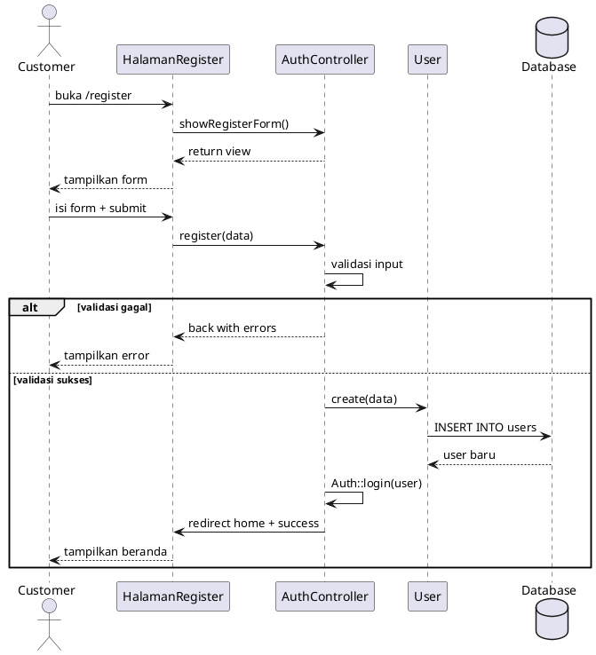

### UC-02: Login Akun

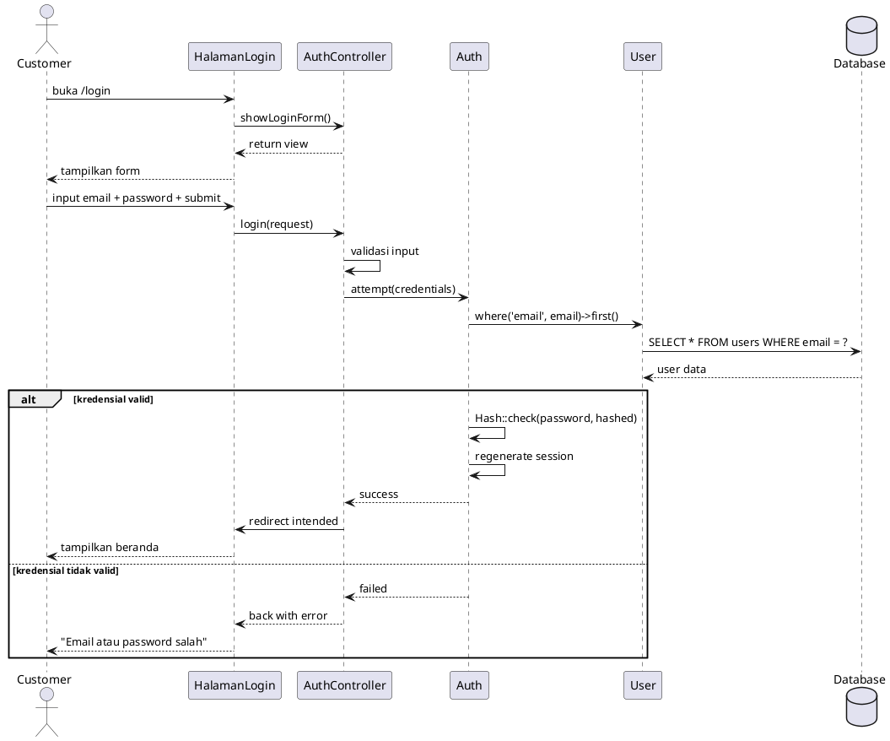

### UC-03: Logout Akun

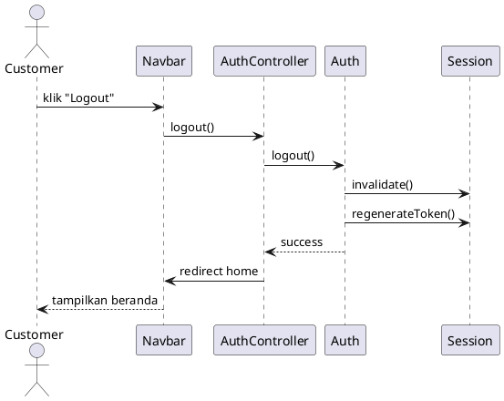

### UC-04: Melihat Beranda

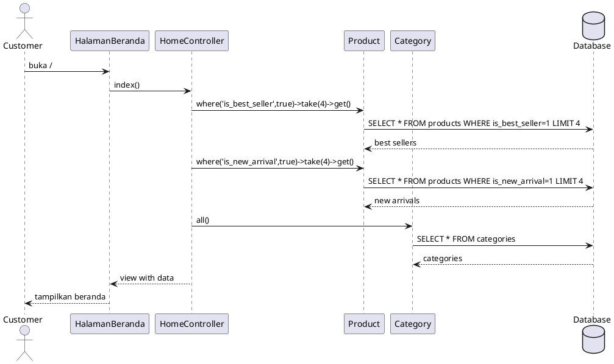

### UC-05: Melihat Katalog Produk

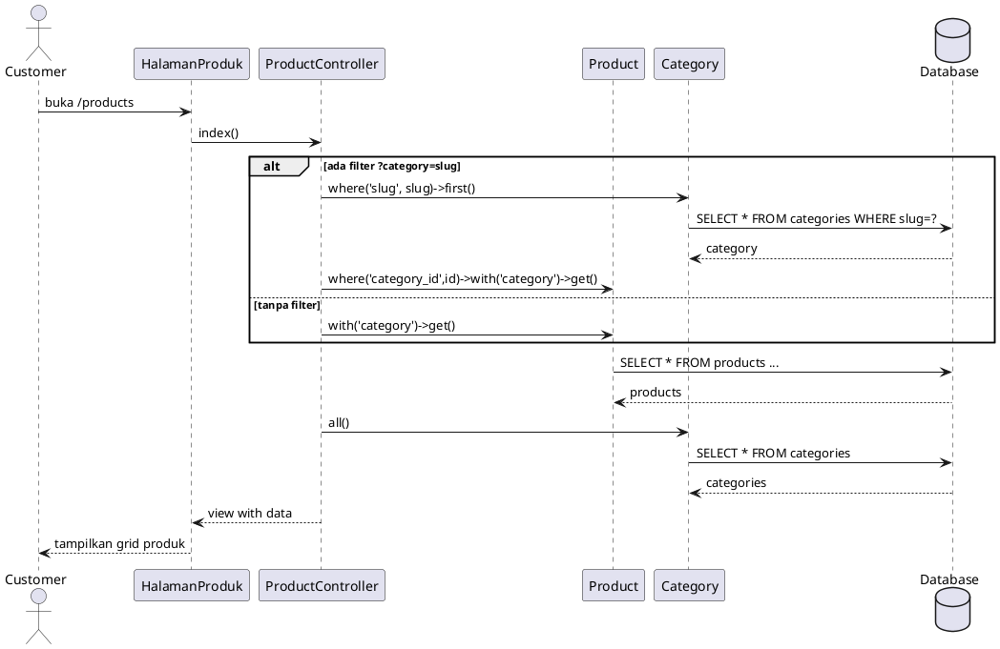

### UC-07: Melihat Detail Produk

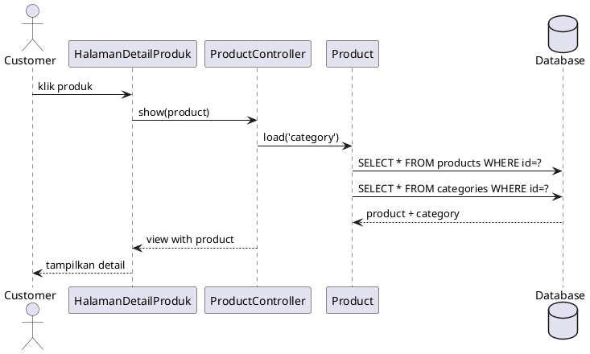

### UC-08: Menambah ke Keranjang

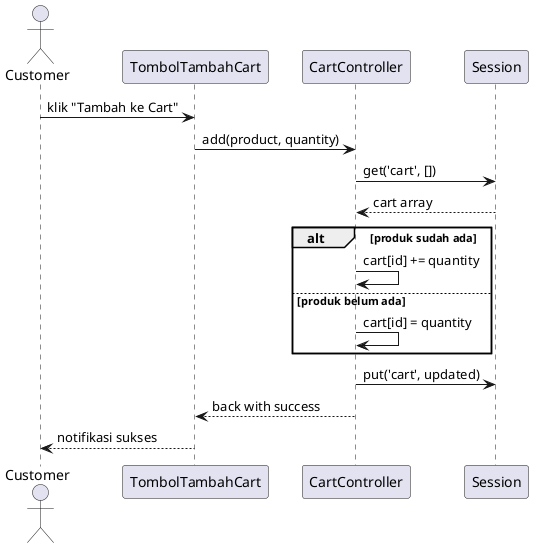

### UC-09: Melakukan Checkout

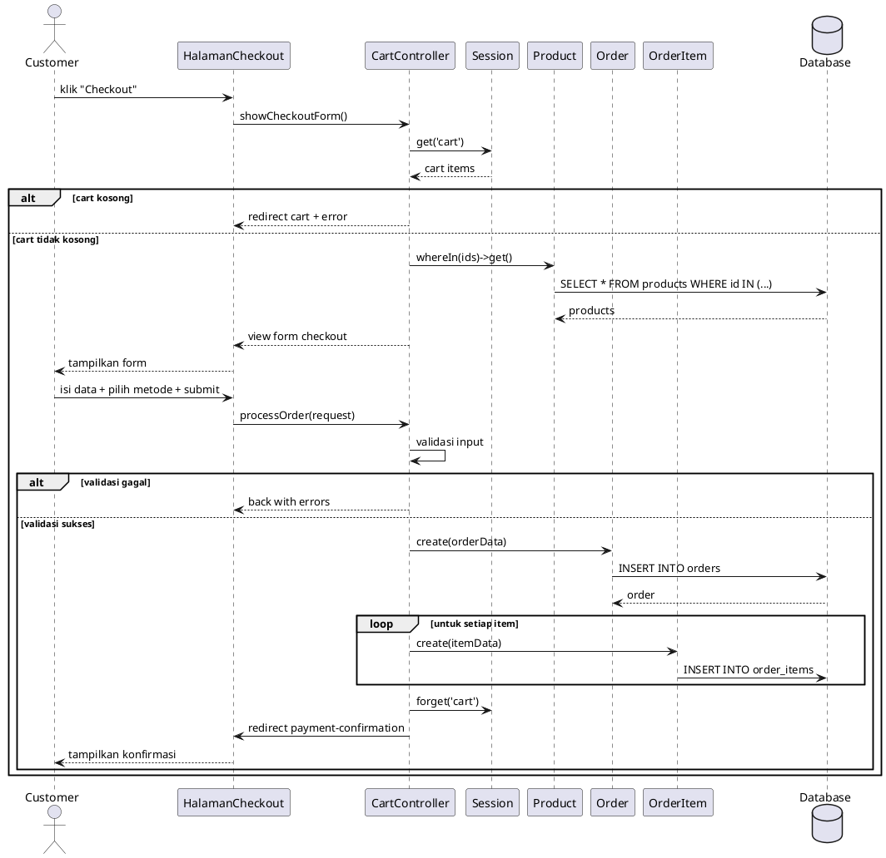

### UC-10: Melihat Konfirmasi Pembayaran

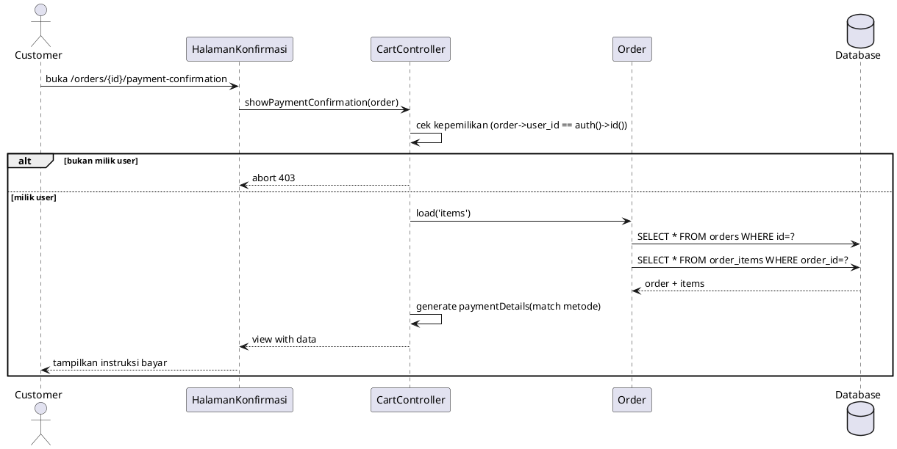

### UC-11: Melihat Riwayat Pesanan

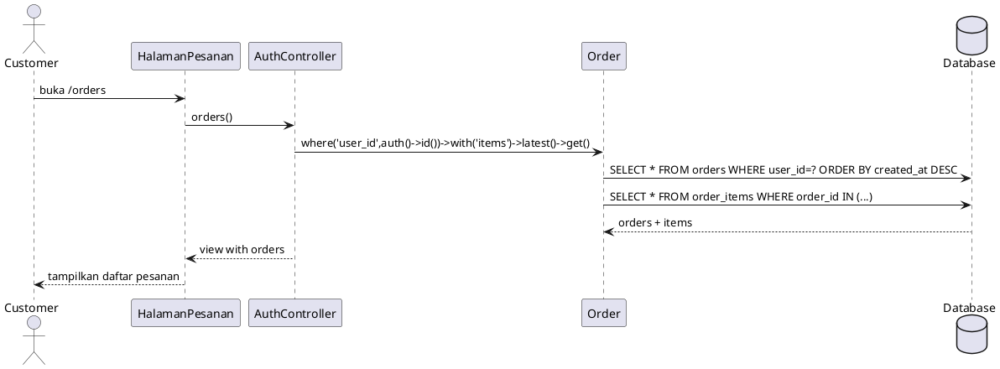

### UC-12: Login Admin

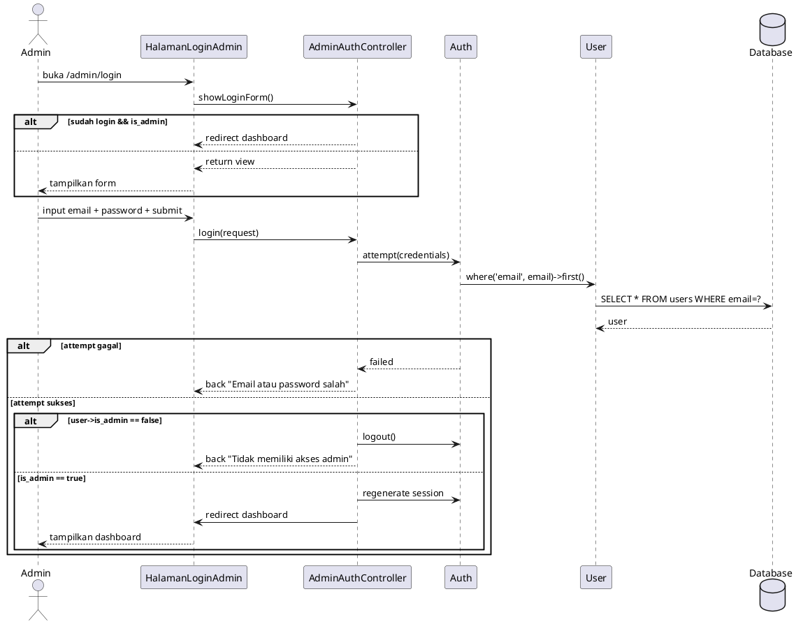

### UC-13: Melihat Dashboard Admin

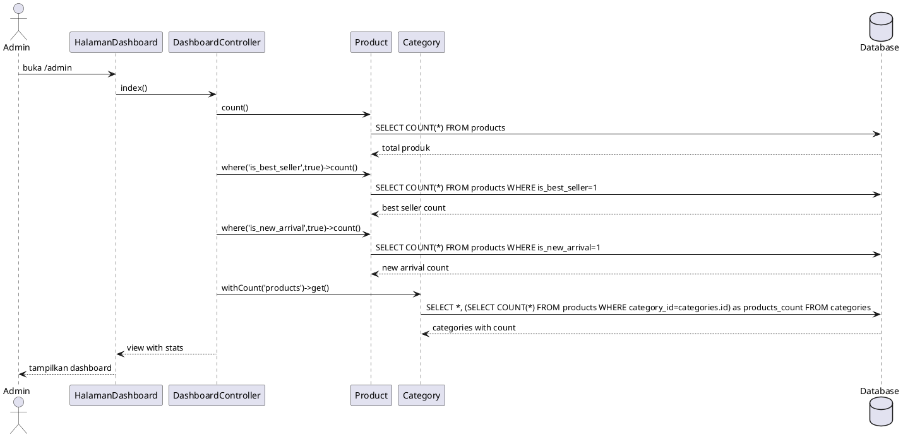

### UC-14: Admin Tambah Produk

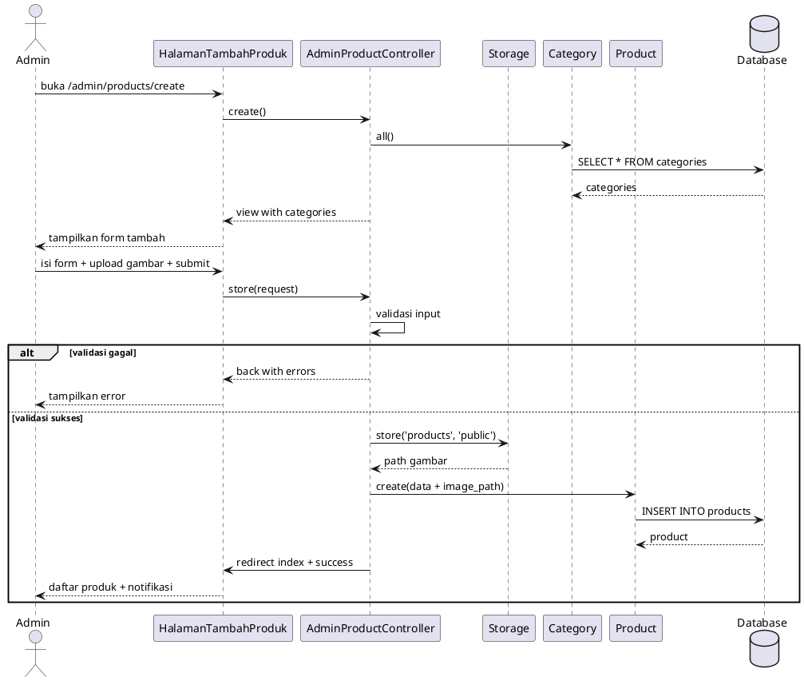

### UC-15: Admin Hapus Kategori

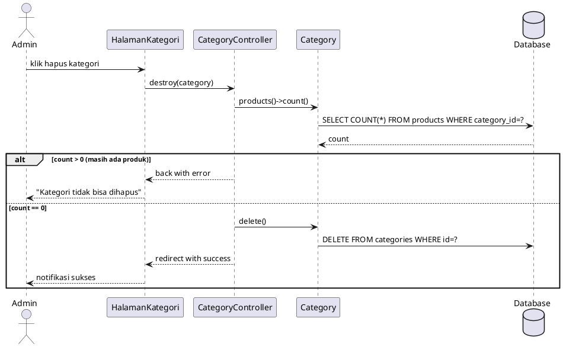
